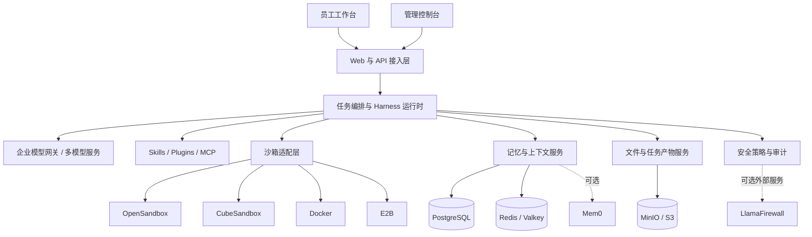

<p align="center">
  
</p>

<h1 align="center">刍狗</h1>

<p align="center">
  面向企业全员的私有化智能助手平台
</p>

<p align="center">
  
  
  
</p>

## 项目定位

刍狗是面向企业员工的智能任务协作平台。用户通过网页提交问题、任务和文件，平台完成任务规划、工具调用、子任务协作与文件产出，并将执行过程和结果实时返回网页端。

平台按企业私有化部署场景设计：模型服务、Skills、MCP 服务、业务数据和沙箱运行环境均可部署在企业网络内部。沙箱提供方由部署环境统一配置，终端用户无需感知底层使用 OpenSandbox、CubeSandbox、Docker 或 E2B。

项目基于 [AgentScope Java](https://github.com/agentscope-ai/agentscope-java) 构建，并在其上形成了面向企业应用的多租户服务、运行时编排、持久化、文件管理、管理后台和安全治理能力。

## 核心能力

| 能力 | 说明 |
| --- | --- |
| 智能任务执行 | 支持对话、任务规划、步骤执行、工具调用、子 Agent 协作和执行过程流式反馈 |
| 多模型接入 | 管理员可配置、测试和维护多个企业模型，用户可在授权范围内切换模型 |
| 动态上下文管理 | 根据模型上下文窗口动态裁剪、摘要和恢复长会话，降低上下文溢出风险 |
| 可恢复运行时 | 对模型输出中断、任务暂停和服务重启提供续跑、重试、检查点和幂等保护 |
| 隔离沙箱执行 | 任务在独立运行环境中执行，支持生命周期管理、资源回收、快照和跨任务恢复 |
| Skills 与 MCP | 支持企业内部技能、插件和 MCP 工具接入，运行时按任务需要装配能力 |
| 文件与产物 | 支持文件上传、任务文件访问、生成产物归档、网页预览与下载 |
| 分层记忆 | 会话记录、任务状态、个人长期记忆和企业岗位知识按职责分层存储与检索 |
| 安全治理 | 提供工具策略、路径隔离、审计记录及可选 LlamaFirewall 外部安全服务集成 |
| 运营管理 | 提供用户、模型、任务、沙箱、技能及平台运行状态等管理入口 |

## 总体架构



系统遵循以下边界：

- PostgreSQL 保存用户、会话、消息、任务、模型配置、审计记录和文件元数据。
- Redis/Valkey 保存租约、并发控制、流式事件和短期运行状态。
- MinIO/S3 保存上传文件、任务产物、快照及其他二进制对象。
- Mem0 作为可选的个人长期记忆投影，不替代业务事实数据库。
- 用户文件、任务生成文件、运行时记忆和系统文件在逻辑目录与权限上相互隔离。

## 技术选型

| 领域 | 主要技术 |
| --- | --- |
| 服务端 | Java 17+、Spring Boot、WebFlux、Spring Security |
| Agent 运行时 | AgentScope Java、Harness、AG-UI |
| 数据访问 | DDD 分层、MyBatis、Flyway |
| 前端 | React、TypeScript、Vite |
| 数据与对象存储 | PostgreSQL、Redis/Valkey、MinIO/S3 |
| 沙箱 | OpenSandbox、CubeSandbox、Docker、E2B |
| 可观测性 | Spring Boot Actuator、Micrometer、Prometheus |
| 安全扩展 | 本地安全策略链、LlamaFirewall 可选服务 |

## 快速开始

### 环境要求

- JDK 17 或更高版本
- Maven 3.9 或更高版本
- Docker Desktop 或 Docker Engine
- 本地已准备项目所需的 PostgreSQL、Redis、MinIO 和 OpenSandbox 镜像或容器

### 一键启动

推荐使用 OpenSandbox 本地验证脚本。脚本会检查 Docker，并拉起本机已有的依赖容器和应用服务：

```bash
./agentscope-saas/agentscope-saas-app/scripts/start-opensandbox-local.sh
```

启动完成后访问：

- 用户端与管理端：<http://localhost:18080>
- 本地管理员账号：`admin@demo.local`
- 本地默认密码：`password`

执行包含沙箱任务链路的冒烟验证：

```bash
./agentscope-saas/agentscope-saas-app/scripts/start-opensandbox-local.sh --smoke
```

停止应用及本次使用的 Docker 依赖：

```bash
./agentscope-saas/agentscope-saas-app/scripts/stop-opensandbox-local.sh
```

脚本支持通过 `--port`、`--no-docker` 等参数调整启动方式，详情可执行 `--help` 查看。

### 轻量本地模式

仅验证基础 Web、API 和任务流程时，可以使用不依赖外部中间件的本地配置：

```bash
mvn -pl agentscope-saas/agentscope-saas-app -am spring-boot:run \
  -Dspring-boot.run.profiles=local
```

默认访问地址为 <http://localhost:8080>。

## 企业环境配置

企业环境通过部署配置注入模型、数据库、对象存储、缓存、沙箱和安全服务地址，敏感信息不进入源码仓库。

```bash
cp agentscope-saas/agentscope-saas-app/scripts/company-dev-env.sh.example \
   agentscope-saas/agentscope-saas-app/scripts/company-dev-env.sh

./agentscope-saas/agentscope-saas-app/scripts/start-company-dev.sh
```

主要配置类别包括：

- 企业模型服务地址、认证信息、模型上下文窗口和调用参数
- PostgreSQL、Redis/Valkey、MinIO/S3 连接信息
- 沙箱提供方、模板、持久卷、资源配额和回收策略
- 企业 Skills、插件市场与 MCP 服务地址
- 身份提供方、租户策略和访问控制配置
- LlamaFirewall 等可选外部安全服务

## 沙箱部署策略

沙箱提供方是部署决策，不是用户选项。不同环境使用相同的运行时接口和任务协议：

| 环境 | 建议方案 | 用途 |
| --- | --- | --- |
| 本地开发与集成验证 | OpenSandbox 或 Docker | 快速调试、自动化测试和离线验证 |
| 企业测试环境 | OpenSandbox 或 CubeSandbox | 验证网络、持久化卷、模板和资源回收策略 |
| 企业生产环境 | CubeSandbox 或企业托管 OpenSandbox | 提供集中资源管理、隔离、持久化和运维能力 |
| 外部兼容性测试 | E2B | 验证云沙箱适配层，不作为私有化部署前提 |

通过 `SAAS_SANDBOX_TYPE=docker|opensandbox|cube|e2b` 选择提供方。父 Agent 与子 Agent 默认共享同一任务沙箱，避免重复创建资源，并保证子任务可访问同一工作区文件。

## 工程结构

```text
agentscope-java-main/
├── agentscope-core/                   # AgentScope 核心能力
├── agentscope-extensions/             # 模型、工具与生态扩展
├── agentscope-saas/
│   ├── agentscope-saas-domain/        # 领域模型与仓储接口
│   ├── agentscope-saas-core/          # 企业平台核心应用能力
│   ├── agentscope-saas-orchestration/ # 任务编排与运行时
│   ├── agentscope-saas-dal/           # MyBatis 数据访问实现
│   ├── agentscope-saas-storage/       # 文件与对象存储
│   ├── agentscope-saas-sandbox/       # 多沙箱适配与生命周期管理
│   └── agentscope-saas-app/           # Spring Boot 应用、API 与前端
└── docs/enterprise-platform-java/     # 企业平台设计与实施文档
```

## 开发验证

运行企业平台模块测试：

```bash
mvn -pl agentscope-saas/agentscope-saas-app -am test
```

构建包含前端资源的应用：

```bash
mvn -pl agentscope-saas/agentscope-saas-app -am package -Pfrontend
```

涉及沙箱、对象存储或安全外部服务的能力，应额外执行对应的集成或冒烟测试。OpenSandbox 是当前本地沙箱验证的默认门禁。

## 方案文档

- [平台总体架构](docs/enterprise-platform-java/02-architecture.md)
- [任务执行与沙箱方案](docs/enterprise-platform-java/03-execution-and-sandbox.md)
- [运行时与数据架构](docs/enterprise-platform-java/06-runtime-and-data.md)
- [记忆与资源设计](docs/enterprise-platform-java/17-memory-resource-design.md)
- [企业记忆与岗位画像方案](docs/enterprise-platform-java/18-enterprise-memory-profile-implementation.md)
- [运行时编排优化方案](docs/enterprise-platform-java/19-runtime-orchestration-optimization-plan.md)
- [持久化与对象存储升级方案](docs/enterprise-platform-java/13-storage-upgrade.md)
- [LlamaFirewall 集成方案](docs/enterprise-platform-java/33-llamafirewall-integration.md)
- [模型流式中断恢复方案](docs/enterprise-platform-java/34-model-stream-recovery-design.md)

## 参与贡献

提交代码前请阅读 [中文贡献指南](CONTRIBUTING_zh.md) 或 [English Contributing Guide](CONTRIBUTING.md)。贡献内容需要遵守 DDD 模块边界、MyBatis 数据访问规范、租户隔离规则以及对应的测试门禁。

## AgentScope Java

本项目复用 AgentScope Java 的 Agent、模型、消息、工具、记忆和多智能体基础能力，并在其上增加企业平台所需的服务化运行时与治理能力。框架使用方式请参考：

- [AgentScope Java 官方仓库](https://github.com/agentscope-ai/agentscope-java)
- [AgentScope 官方文档](https://java.agentscope.io/)

## License

本项目遵循 [Apache License 2.0](https://www.apache.org/licenses/LICENSE-2.0) 许可证。
