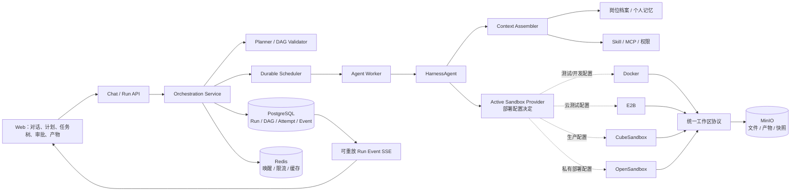

# 19. 企业智能助手运行框架优化落地方案

> 状态：Phase 0-1 已完成；Phase 2 的可靠调度、持久化子 Agent、父协调器续跑和有界结果回灌已完成
>
> 适用范围：`agentscope-saas` 企业智能助手运行时
>
> 设计日期：2026-07-15
>
> 依赖基线：AgentScope Harness、PostgreSQL、Redis、MinIO、可配置沙箱 Provider

## 1. 文档定位

本文给出企业智能助手任务规划、任务拆解、子 Agent、后台任务、沙箱资源、事件恢复和结果验证的完整优化方案。方案吸收 Hermes Agent 和 Claude Code 在上下文隔离、任务 DAG、子 Agent 委派和验证方面的优点，但不复制其面向单机的线程、文件注册表、Worktree 或进程内状态实现。

本文是运行框架和任务编排方向的权威方案。涉及以下主题时，以本文为准：

- 复杂任务如何规划、拆解和调度；
- 子 Agent 如何创建、执行、恢复和回传结果；
- Docker、E2B、CubeSandbox、OpenSandbox 如何配置切换；
- 用户工作区与并行任务执行空间如何隔离；
- 浏览器断线、服务重启、Worker 失效后如何恢复；
- 任务在什么条件下可以标记为完成。

本文修正早期文档中的两个假设：

1. `IsolationScope.USER` 可以继续用于交互式用户工作区，但不能作为并行写任务的唯一隔离边界。
2. OpenSandbox、CubeSandbox、E2B 或 Docker 都只是可替换 Provider，编排层不得绑定任何具体沙箱产品。

## 2. 核心结论

当前 AgentScope 框架已经具备 ReAct、持久化状态、Plan Mode、Todo、动态子 Agent、后台任务、权限中间件和多种沙箱实现。优化不应重写 Harness，而应在 SaaS 外层增加企业级任务编排控制面。

目标方案采用以下技术原则：

| 领域 | 技术决策 |
|------|----------|
| 任务与运行事实 | PostgreSQL 是唯一事实源 |
| 调度通知和短期状态 | Redis 只负责唤醒、限流、锁和缓存 |
| 文件、产物和工作区快照 | MinIO/S3 保存对象，PostgreSQL 保存目录和版本 |
| 长期记忆 | PostgreSQL 保存记忆卡片，Mem0 仅作可重建语义投影 |
| 沙箱 | 统一 Provider SPI；每套部署通过配置激活一个 Docker/E2B/Cube/OpenSandbox 后端 |
| 子 Agent | 默认新建精简上下文，完整上下文分叉仅作为受控选项 |
| 后台执行 | 使用持久化任务、lease、heartbeat、attempt，不依赖 JVM 线程状态 |
| 前端事件 | PostgreSQL 按 Run 序列持久化，SSE 支持断线重放 |
| 完成条件 | 必须满足验收条件并提供验证证据 |

## 3. 目标架构



### 3.1 模块边界

建议新增 `agentscope-saas-orchestration` 模块，保持领域模型与 Spring Web、具体沙箱 SDK 解耦。

```text
agentscope-saas/
├── agentscope-saas-core/             # 租户、会话、文件、记忆、审计
├── agentscope-saas-orchestration/    # 新增：Run、DAG、调度、恢复、验证
├── agentscope-saas-sandbox/          # Provider、租约、配额、资源回收
├── agentscope-saas-storage/          # MinIO/PG 对象和快照
└── agentscope-saas-app/              # 配置装配、REST/SSE、Worker、前端
```

`agentscope-saas-orchestration` 内部分层：

| 分层 | 职责 |
|------|------|
| `domain` | Run、TaskNode、AgentRun、Attempt、Approval、Artifact 状态机 |
| `application` | 规划、调度、取消、重试、恢复、验证、结果聚合 |
| `port` | Repository、AgentRuntime、SandboxRuntime、EventPublisher 接口 |
| `adapter.persistence` | PostgreSQL Repository、事务和 Outbox |
| `adapter.harness` | HarnessAgent、TaskRepository、AgentSpawnTool 适配 |
| `adapter.web` | Run、审批、任务树、事件、取消和重试 API |

## 4. 运行领域模型

### 4.1 数据表

所有表包含 `org_id`，启用 PostgreSQL RLS，并通过 service 层租户条件形成双重隔离。

| 表 | 主要字段 | 作用 |
|----|----------|------|
| `assistant_runs` | `id, user_id, agent_id, session_id, trigger_message_id, mode, status, version` | 一次用户请求的顶层运行 |
| `task_nodes` | `id, run_id, parent_id, title, input_json, expected_output_json, status, priority, owner_agent_run_id` | 结构化任务节点 |
| `task_edges` | `run_id, from_task_id, to_task_id, edge_type` | 任务依赖 DAG |
| `agent_runs` | `id, run_id, task_id, parent_agent_run_id, agent_type, model, status, depth` | 主 Agent 和子 Agent 逻辑实例 |
| `run_attempts` | `id, task_id, agent_run_id, attempt_no, status, lease_owner, lease_expires_at, heartbeat_at` | 每次实际执行和失败恢复 |
| `run_events` | `run_id, seq, event_type, payload_json, created_at` | 可重放事件流 |
| `run_artifacts` | `run_id, task_id, file_id, artifact_type, evidence_json` | 文件、报告、截图和验证证据 |
| `run_approvals` | `run_id, task_id, approval_type, status, request_json, decision_json` | 计划和危险操作审批 |
| `sandbox_leases` | `run_id, task_id, attempt_id, provider_id, provider_sandbox_id, provider_state_json, status` | Provider 中立沙箱租约 |
| `orchestration_outbox` | `aggregate_id, event_type, payload_json, published_at` | 事务后可靠唤醒和事件投递 |

必须建立以下约束：

- `run_events(run_id, seq)` 唯一；
- `run_attempts(task_id, attempt_no)` 唯一；
- `task_edges` 不允许重复边和自依赖；
- 一个 Task 同时最多存在一个有效 lease；
- `assistant_runs`、`task_nodes` 和 `agent_runs` 使用 `version` 乐观锁；
- 创建 Run、重试和审批接口必须支持 `idempotency_key`；
- 状态变更使用条件更新，不允许直接覆盖终态。

### 4.2 状态机

```text
Run:
CREATED -> PLANNING -> WAITING_APPROVAL -> RUNNING -> VERIFYING
        -> SUCCEEDED | FAILED | CANCELLED

TaskNode:
PENDING -> READY -> CLAIMED -> RUNNING -> VERIFYING
        -> SUCCEEDED | FAILED | CANCELLED | MANUAL_ACTION

Attempt:
CREATED -> LEASED -> RUNNING
        -> SUCCEEDED | FAILED | TIMED_OUT | ABANDONED | CANCELLED

SandboxLease:
REQUESTED -> PROVISIONING -> ACTIVE -> CHECKPOINTING
          -> RELEASED | EXPIRED | RELEASE_FAILED
```

状态转换统一由 Domain Service 执行。任务依赖全部成功后，TaskNode 才能从 `PENDING` 进入 `READY`；任何前置任务失败时，根据边策略进入取消、降级或人工处理。

## 5. 任务规划与拆解

### 5.1 复杂度路由

新增 `TaskComplexityRouter`，避免所有请求都进入重型多 Agent 流程。

| 类型 | 判定示例 | 执行方式 |
|------|----------|----------|
| `DIRECT` | 普通问答、不调用工具 | 一个 Run、一个 TaskNode、无沙箱 |
| `SIMPLE_TOOL` | 单次检索、单文件操作 | 一个 Run、一个执行节点 |
| `PLANNED` | 多步骤、多文件、长耗时、有依赖 | 结构化计划和 DAG |
| `APPROVAL_REQUIRED` | 高风险写入、外发、发布、敏感数据 | 计划审批后执行 |

用户显式要求制定计划时直接进入 Plan Mode。系统可根据工具数量、预估时长、产物数量、并行机会和风险等级自动升级为 `PLANNED`。

### 5.2 结构化计划

保留 Harness 的 Plan Mode 作为只读规划环境和人工确认入口，但不解析 Markdown 文本作为调度依据。新增 `plan_publish` 工具，要求模型提交结构化 `ExecutionPlan`：

```json
{
  "goal": "生成并验证项目报告",
  "tasks": [
    {
      "clientTaskId": "research",
      "title": "收集资料",
      "agentType": "researcher",
      "dependsOn": [],
      "workspaceMode": "SHARED_READ_ONLY",
      "expectedOutputs": ["research-summary"],
      "acceptanceCriteria": ["来源完整", "结论可追溯"]
    }
  ]
}
```

`ExecutionPlanValidator` 在入库前确定性校验：

- DAG 无环且依赖存在；
- 节点数、深度、扇出和并行度不超过配额；
- Agent、模型、Skill、MCP 和工具在租户允许范围内；
- 写任务声明工作区隔离策略；
- 高风险节点包含审批或验证节点；
- 预估 Token、运行时间、沙箱数量和存储量不超预算；
- 任务输入不直接携带密钥和超大上下文。

计划 Markdown 是用户展示和审计投影，结构化 DAG 是调度事实源。

### 5.3 运行时重规划

允许在以下情况下创建计划修订版：

- 依赖信息不足；
- 工具或 Provider 不可用；
- 任务重试达到上限；
- 验证失败且需要补充任务；
- 用户修改目标。

已成功节点不重复执行。新版本记录 `supersedes_plan_version`，保留完整审计链。重大范围变化必须重新请求用户审批。

## 6. 子 Agent 运行机制

### 6.1 与现有 Harness 的集成

现有动态子 Agent 定义和 `DynamicSubagentsMiddleware` 继续负责 Agent 类型发现。后台执行从 `WorkspaceTaskRepository + JVM Future` 逐步迁移为持久化编排：

1. 新增 `PgTaskRepository` 实现现有 `TaskRepository`，兼容 `AgentSpawnTool` 和 `TaskTool`；
2. 新增 `DurableAgentRuntimeAdapter`，把 spawn 转换为 `task_nodes + agent_runs + run_attempts`；
3. 同步 spawn 等待持久化完成事件，异步 spawn 立即返回 Task ID；
4. `WorkspaceTaskRepository` 只保留为示例、本地无数据库模式和回退实现；
5. 更丰富的任务依赖、认领和验证通过新的 Orchestration Tools 提供，不强行塞入旧 `TaskRepository` 接口。

### 6.2 上下文策略

子 Agent 默认使用精简的新上下文，只装配：

- 当前任务目标、输入、验收条件和预算；
- 已完成依赖任务的摘要与 Artifact 引用；
- 企业维护的岗位档案；
- 与当前任务相关的个人记忆卡片；
- 当前任务允许的 Skill、MCP、模型和工具；
- 必需的文件目录，不复制完整会话历史。

完整父上下文分叉仅用于高度依赖上下文的任务，并设置最大消息数、Token、敏感字段过滤和最大递归深度。子 Agent 权限只能等于或小于父 Agent。

### 6.3 结构化结果

子 Agent 必须返回：

```text
status
summary
evidence[]
artifactRefs[]
followUpTasks[]
usage{tokens, duration, sandboxSeconds}
```

摘要有独立 Token 上限。大文件、日志和工具输出写入 MinIO，通过引用传递，不能全部回灌父 Agent 上下文。

### 6.4 并发和预算

配置四级限制：平台、组织、用户、Run。至少包含：

- 最大活动 Run 数；
- 最大子 Agent 数和并行数；
- 最大委派深度和任务扇出；
- Run/Task 最大时长；
- 模型 Token 和费用预算；
- 沙箱 CPU、内存、存储和运行秒数；
- 外部工具调用次数。

超出预算时不继续 spawn，Run 进入等待用户确认、降级执行或失败状态。

## 7. 持久化调度与故障恢复

### 7.1 调度机制

首期不引入 Kafka 或独立消息队列，使用 PostgreSQL 保证正确性：

1. Scheduler 使用 `FOR UPDATE SKIP LOCKED` 批量认领 `READY` 节点；
2. 在同一事务中创建 Attempt、写 lease 和 Outbox；
3. Redis Pub/Sub 或 Stream 用于低延迟唤醒，数据库轮询作为兜底；
4. Worker 按固定间隔更新 heartbeat 和 lease；
5. 完成结果、Task 状态和完成事件在同一事务提交；
6. Outbox Publisher 将事件推送到 SSE 通知层和父 Agent 唤醒通道。

建议初始参数：heartbeat 20 秒、lease 60 秒、调度轮询 1 秒，均允许配置。

### 7.2 重试语义

| 任务类型 | 默认策略 |
|----------|----------|
| 只读、幂等任务 | 指数退避自动重试，可换 Worker/Provider |
| 有幂等键的写任务 | 校验幂等结果后重试 |
| 无法确认幂等的写任务 | 进入 `MANUAL_ACTION` |
| 权限或审批拒绝 | 不重试 |
| 配额不足 | 等待配额或用户确认 |
| Provider 暂时不可用 | 在当前 Provider 内重试或从 checkpoint 重建，超过阈值后明确失败并告警 |

Worker 失联后 Attempt 标记 `ABANDONED`，不能把原 Attempt 直接改回待执行；每次重试必须创建新 Attempt，保留历史证据。

### 7.3 父 Agent 唤醒

子任务完成后先写 `run_events`，再唤醒协调 Agent。父 Agent 从 PostgreSQL 读取未处理完成事件并标记消费位置。应用重启不会丢失完成通知，也不依赖原 JVM 内的 callback。

## 8. Provider 中立沙箱机制

### 8.1 设计目标

编排层只表达“需要什么运行能力”，不表达“调用哪个厂商 API”。Docker、E2B、CubeSandbox、OpenSandbox 均可由同一套应用代码支持，未来 Kubernetes、Daytona 也可按相同方式接入。

**Provider 选择发生在部署时，而不是用户请求运行时。**每套应用部署只激活一个 Provider：例如本地和 CI 使用 Docker，云测试环境使用 E2B，企业生产环境使用 CubeSandbox，另一套私有环境可以使用 OpenSandbox。普通用户、任务规划器和子 Agent 均不感知 Provider，也不能按用户或任务自行选择后端。

现有 Harness `SandboxClient` 和 `Sandbox` 继续作为底层执行抽象。在 SaaS 资源层新增面向统一生命周期和治理的 Provider SPI：

```java
public interface SandboxRuntimeProvider {
    String providerId();
    SandboxCapabilities capabilities();
    SandboxLease acquire(SandboxRequest request);
    SandboxLease resume(SandboxLeaseRecord record);
    void release(SandboxLease lease, ReleaseMode mode);
    ProviderHealth health();
}
```

核心组件：

| 组件 | 职责 |
|------|------|
| `SandboxProviderFactory` | 根据部署配置创建唯一活动 Provider |
| `ActiveSandboxProvider` | 向编排层暴露当前部署选中的 Provider |
| `SandboxLeaseService` | 创建、恢复、续租、释放和异常回收 |
| `SandboxWorkspaceService` | hydrate、checkpoint、persist 和 Artifact 发布 |
| `SandboxCommandService` | 命令执行、超时和可选命令级取消 |
| `SandboxProviderHealthService` | 健康检查、熔断和容量信息 |

具体适配器包装已有实现：

| Provider | Adapter | 建议用途 |
|----------|---------|----------|
| Docker | `DockerSandboxProvider` | 本地开发、CI、单机私有部署 |
| E2B | `E2bSandboxProvider` | 云端验证和弹性临时执行 |
| CubeSandbox | `CubeSandboxProvider` | 企业内网运行环境 |
| OpenSandbox | `OpenSandboxProvider` | 企业自建 Docker/Kubernetes 运行平台 |

### 8.2 能力协商

活动 Provider 启动时声明能力，Task 通过 `requiredCapabilities` 表达硬要求：

```text
SNAPSHOT
SUSPEND_RESUME
RESOURCE_LIMITS
NETWORK_POLICY
COMMAND_CANCEL
CONCURRENT_EXEC
CUSTOM_IMAGE
CUSTOM_TEMPLATE
```

应用启动时校验生产基线能力，任务执行前校验任务特有能力。能力不匹配时不能运行时改选另一个 Provider，而是按以下规则确定性处理：

- 不支持命令级取消：销毁当前 Attempt 的独立沙箱；
- 不支持暂停恢复：checkpoint 到 MinIO 后释放，下次重新创建；
- 不支持原生快照：调用统一 `persistWorkspace()`；
- 不支持资源限制：生产高风险任务拒绝运行，不静默降级；
- 不支持并发执行：并行子任务使用独立沙箱；
- 不支持指定模板：根据管理员维护的等价镜像映射选择，找不到则失败。

### 8.3 配置模型

保留现有 `saas.sandbox.type` 作为部署选择入口。同一个应用制品在不同环境使用不同配置，每套部署只能选择一个活动 Provider：

```yaml
saas:
  sandbox:
    enabled: true
    type: ${SAAS_SANDBOX_TYPE:docker}
    image: agentscope-runtime:latest
    workspace-root: /workspace

    e2b-api-key: ${E2B_API_KEY:}
    e2b-template-id: base

    cube-api-url: ${CUBE_API_URL:}
    cube-api-key: ${CUBE_API_KEY:}
    cube-template-id: tpl-sandbox-code

    opensandbox-api-base-url: ${OPENSANDBOX_API_BASE_URL:}
    opensandbox-api-key: ${OPENSANDBOX_API_KEY:}
```

推荐部署映射：

| 环境 | `saas.sandbox.type` | 说明 |
|------|---------------------|------|
| 本地开发/CI | `docker` | 成本低、易复现，作为自动化测试基线 |
| 云端测试 | `e2b` | 验证云沙箱和远程生命周期 |
| 企业生产 | `cube` | 使用企业内网 CubeSandbox 和受管模板 |
| 其他私有部署 | `opensandbox` | 使用企业自建 OpenSandbox 服务 |

配置规则：

- Spring 启动时只创建 `type` 对应的活动 Provider；
- 未选中的 Provider 不建立连接，也不要求提供密钥；
- Provider 配置错误或不满足生产基线能力时启动失败，禁止静默回退；
- 已存在 lease 必须使用记录中的 `provider_id` 恢复；
- Provider 密钥只从环境变量或企业密钥系统读取，不写入数据库状态和事件；
- Provider 类型不进入用户 API、任务 Prompt 和普通用户界面；
- 管理员只能在运维和资源监控页面查看当前部署 Provider 与健康状态。

### 8.4 租约持久化

`sandbox_leases` 至少保存：

```text
id, org_id, user_id, run_id, task_id, attempt_id
provider_id, provider_sandbox_id, provider_state_json
image_or_template, capabilities_json
workspace_snapshot_uri, workspace_version
status, lease_owner, lease_expires_at, last_heartbeat_at
created_at, released_at, release_error
```

`provider_state_json` 是不透明数据，只能由对应 Provider 反序列化。编排层不能读取 E2B、Cube 或 OpenSandbox 的内部字段。

### 8.5 部署切换与故障处理

系统不在任务运行过程中自动从一个 Provider 路由到另一个 Provider。当前 Provider 故障时，在原 Provider 内执行恢复、重建或重试；超过阈值后任务明确失败或进入人工处理，避免在不同执行环境间产生不可预测的副作用。

测试环境和生产环境通常是独立部署，分别配置自己的 Provider，不涉及活动任务迁移。如果同一套环境确实需要更换 Provider，采用受控部署流程：

1. 停止接收新的沙箱任务；
2. 等待活动 Run 完成，或将可恢复任务 checkpoint 到 MinIO；
3. 释放并核对旧 Provider 的全部活动 lease；
4. 修改部署配置并重启应用；
5. 启动时验证新 Provider 的连接、模板和能力；
6. 通过 Smoke Test 后恢复流量；
7. 未完成任务创建新 Attempt，从持久化 checkpoint 恢复，不把旧 Provider 状态交给新 Provider resume。

`sandbox_leases.provider_id` 仍必须保存，用于审计、资源回收和防止错误恢复。应用发现历史 lease 与当前部署 Provider 不一致时，应进入 reconciliation 或人工处理，不能自动反序列化和继续执行。

## 9. 工作区和文件持久化

### 9.1 隔离策略

新增编排层 `WorkspaceIsolationMode`，不直接扩展或滥用 Harness 的 `IsolationScope`：

| 模式 | 用途 | 实现 |
|------|------|------|
| `NONE` | 普通问答 | 不申请沙箱 |
| `USER_SHARED_READ_ONLY` | 资料读取、检索 | 用户工作区只读快照 |
| `RUN_ISOLATED` | 单写任务 | Run 独立目录或沙箱 |
| `ATTEMPT_ISOLATED` | 并行写子任务 | Attempt 独立 Overlay、Worktree 或沙箱 |
| `DEDICATED_SANDBOX` | 高风险任务 | 独立资源和严格网络策略 |

编排器提前申请沙箱，并通过 RuntimeContext 的 external sandbox 入口交给 Harness。这样无需让 Agent 知道 Provider 和真实根路径。

### 9.2 文件流转

```text
PG 文件目录 + MinIO 当前版本
        -> hydrate 到任务隔离工作区
        -> Agent/工具执行
        -> checkpoint 临时状态
        -> 验证成功
        -> ArtifactPublisher 发布文件版本
        -> 更新 PG 文件目录
        -> 释放沙箱
```

Agent 始终使用相对路径。Docker 的 `/workspace`、E2B/Cube 的实际目录和 OpenSandbox 镜像路径由 Provider Adapter 处理。

并行写任务不得直接修改同一个用户共享目录。合并通过 Artifact 和文件版本服务完成，使用基础版本号或 SHA-256 做乐观冲突检测。冲突时创建合并任务或请求用户处理，禁止最后写入者静默覆盖。

## 10. 记忆与任务上下文

岗位档案和个人记忆继续遵循 [18. 企业岗位档案与个人记忆实施方案](./18-enterprise-memory-profile-implementation.md)：

- 岗位、部门、职责和组织关系由企业维护，Agent 只读；
- 个人偏好、用户自述能力和任务经验以 PG 记忆卡片管理；
- Mem0 只保存已生效记忆的语义投影；
- 原始对话、任务事件、工具日志和文件正文不写入 Mem0；
- 任务开始前按目标检索相关信息，不全量加载长 Session。

新增 `TaskContextAssembler`，按固定预算组装：

```text
系统和岗位约束
当前任务与验收条件
依赖任务摘要
相关个人/项目记忆
允许的 Skill/MCP/工具
文件和 Artifact 引用
必要的最近对话窗口
```

任务成功并验证后，可以产生“记忆候选”，但不能直接写入生效记忆。失败任务只保存运行经验和审计证据，不自动固化为用户偏好。

## 11. 取消、断线和恢复

当前 Web 断开后调用无上下文 `agent.interrupt()` 的路径必须优先修正。目标语义：

- 浏览器或 SSE 断开只解除订阅，Run 继续执行；
- 用户显式调用 `POST /runs/{runId}/cancel` 才发起取消；
- 取消精确作用于 `orgId + userId + sessionId + runId`；
- 取消沿 Run、Task、Attempt、Agent、工具命令和沙箱传播；
- Provider 支持命令取消时取消命令，不支持时关闭 Attempt 独立沙箱；
- 取消状态和原因必须持久化；
- 前端重新连接携带 `Last-Event-ID` 或 `afterSeq`，从 PG 继续读取事件。

服务重启后不恢复旧 Reactor 订阅，而是根据 Run、Task、Attempt 和 lease 状态重建运行。用户重新进入页面可以看到当前状态、历史事件和最终产物。

## 12. 事件、API 和前端

### 12.1 Run API

保留现有 Chat API 兼容性，但内部统一创建 Run。新增：

```text
POST   /api/agents/{agentId}/runs
GET    /api/agents/{agentId}/runs/{runId}
GET    /api/agents/{agentId}/runs/{runId}/tasks
GET    /api/agents/{agentId}/runs/{runId}/events?afterSeq={seq}
POST   /api/agents/{agentId}/runs/{runId}/approve
POST   /api/agents/{agentId}/runs/{runId}/cancel
POST   /api/agents/{agentId}/runs/{runId}/retry
GET    /api/agents/{agentId}/runs/{runId}/artifacts
```

创建、审批、取消和重试均要求幂等键。所有接口校验 org/user/agent 所有权。

### 12.2 事件类型

至少包含：

```text
RUN_CREATED, PLAN_STARTED, PLAN_PROPOSED, APPROVAL_REQUIRED
RUN_STARTED, TASK_READY, TASK_STARTED, TASK_PROGRESS
AGENT_STARTED, TOOL_STARTED, TOOL_FINISHED
ARTIFACT_PUBLISHED, VERIFICATION_STARTED, VERIFICATION_FAILED
TASK_SUCCEEDED, TASK_FAILED, RUN_SUCCEEDED, RUN_FAILED, RUN_CANCELLED
```

模型 Token 流可以短期经内存发送，但关键状态事件必须先持久化。大量 Token 事件可分段压缩或只保存最终消息，避免 `run_events` 无限增长。

### 12.3 前端功能

- 计划预览和审批；
- DAG/任务树、依赖、负责人和状态；
- 主 Agent/子 Agent 运行进度；
- 明确的取消、重试和恢复入口；
- Artifact 列表、预览和下载；
- 验证状态和失败证据；
- SSE 断线自动重连和事件补读；
- Provider 只出现在部署运维和管理员资源监控中，普通用户、任务页面和 Agent Prompt 都不感知具体后端。

## 13. 完成验证机制

新增 `CompletionGate`，Task 只有满足验收条件后才能进入 `SUCCEEDED`。

| 任务类型 | 最低证据 |
|----------|----------|
| 文件生成 | 文件存在、SHA-256、格式检查 |
| 代码修改 | 编译/测试/静态检查结果 |
| 数据处理 | 输入范围、输出行数、校验摘要 |
| 网页操作 | 页面结果、必要截图或响应证据 |
| 高风险写操作 | 审批记录、执行结果和审计事件 |

复杂任务、高风险任务或多个写节点完成后自动创建 Verifier Agent。Verifier 使用独立上下文和只读产物，不相信执行 Agent 的自述。验证失败可生成修复节点，但受最大修复轮次限制。

## 14. 权限和安全

- 子 Agent 继承父 Agent 的租户、用户和 Run 身份；
- 模型、Skill、MCP、工具、网络和文件权限只能向下收缩；
- Provider API Key 通过环境变量或企业密钥系统注入；
- 沙箱内只注入当前任务需要的短期凭证；
- 凭证不得写入 Prompt、Run Event、Artifact、快照和日志；
- 网络访问采用默认拒绝或企业允许列表；
- 所有审批、取消、重试、Provider 迁移和 Artifact 发布写审计日志；
- PG RLS、MinIO object key 和沙箱 namespace 都包含组织边界；
- 动态子 Agent 定义和 Skill 必须经过企业来源和权限检查。

## 15. 可观测性和运维目标

所有日志、Trace 和指标贯穿以下标识：

```text
org_id, user_id, session_id, run_id, task_id,
agent_run_id, attempt_id, sandbox_lease_id, provider_id
```

核心指标：

- Run 创建、成功、失败、取消和耗时；
- READY 队列长度、调度延迟、lease 过期数；
- 子 Agent 数、委派深度和上下文 Token；
- Provider 创建成功率、创建耗时、恢复耗时和释放失败；
- 活动沙箱、空闲沙箱、异常沙箱和泄漏租约；
- SSE 在线连接、重连和事件重放量；
- Artifact 发布失败和验证失败；
- 每组织/用户的模型、沙箱和存储用量。

初始服务目标：

| 指标 | 目标 |
|------|------|
| Run 创建 API P95 | 小于 500ms，不含模型规划 |
| READY 到 Worker 认领 P95 | 小于 2s |
| Worker 失联检测 | 小于 2 个 lease 周期 |
| SSE 断线恢复 | 不丢关键状态事件 |
| 沙箱终态释放 | 99% 在 TTL 内完成，其余进入 reconciliation |
| 跨租户数据访问 | 0 容忍 |

## 16. 配置和发布开关

建议新增以下开关：

```yaml
saas:
  orchestration:
    enabled: false
    scheduler-enabled: false
    planner-enabled: false
    verification-mode: off       # off | risk_based | always

  agent:
    task-list-enabled: false
    plan-mode-enabled: false

  subagents:
    execution-mode: workspace    # workspace | durable
    max-depth: 3
    max-children-per-agent: 8
    max-tasks-per-run: 32

  sandbox:
    type: docker
```

所有新能力默认可关闭，支持按组织灰度。生产切换顺序为：持久化 Run/Event、只读观察、单节点执行、持久化子 Agent、并行任务、自动重试和当前 Provider 内故障恢复。沙箱 Provider 由环境部署配置统一决定，不属于用户或组织级灰度开关。

## 17. 分阶段实施计划

### Phase 0：基线正确性，3-5 个工作日

实施内容：

- 为每次用户请求生成稳定 `runId`；
- 修复无上下文 interrupt，拆分 SSE 断线和显式取消；
- 增加 Plan Mode、Task List 配置开关；
- 明确 RuntimeContext 的 tenant/user/session/run 标识传播；
- 增加取消、断线和并发 Session 测试。

验收：用户关闭网页不会终止任务；显式取消只终止目标 Run，不影响同用户其他 Run。

### Phase 1：持久化控制面，7-10 个工作日

实施内容：

- 新建 orchestration 模块；
- 使用下一可用 Flyway 版本新增 PG/H2 表和索引；
- 实现 Run、Task、Attempt、Event 状态机和 Repository；
- 实现 Run API、事件序列、Outbox 和 SSE 补读；
- 简单任务先统一映射为单节点 Run。

验收：应用重启后仍可查询 Run、任务、事件和终态；重复请求不创建重复 Run。

### Phase 2：可靠调度和子 Agent，8-12 个工作日

实施内容：

- 实现 PG Scheduler、lease、heartbeat 和 retry；
- 实现 Worker 和 Attempt 生命周期；
- 新增 `PgTaskRepository` 和 `DurableAgentRuntimeAdapter`；
- 子 Agent 完成通过持久化事件唤醒父 Agent；
- 实现精简上下文、摘要预算和权限向下继承。

验收：执行中杀死 Worker，幂等任务在 lease 到期后创建新 Attempt 并完成；父 Agent 不丢失子任务结果。

当前落地进度：

- 已完成 PostgreSQL Scheduler、lease、heartbeat、过期恢复、Attempt 重试和条件状态更新；
- 已完成持久化子 Agent、深度/扇出/总任务数限制、父协调器自动续跑和结果仅一次投递；
- 已完成最终回复按 Run 幂等入库，以及 worker 跨线程、Reactor 调度边界的租户上下文传播；
- 已完成子任务结果自动回灌的单条与单轮总量限制，完整结果仍由任务存储按需读取；
- 已增加真实 PostgreSQL 迁移、RLS、双 worker 租约竞争和父子任务全流程验证；
- 待完成按 Run/Task 的 Token、成本和时间预算扣减，以及父子 Agent 权限子集快照与审计。

### Phase 3：部署可切换沙箱和工作区隔离，8-12 个工作日

实施内容：

- 实现 Provider SPI、Factory、ActiveProvider 和 LeaseService；
- 包装 Docker、E2B、CubeSandbox、OpenSandbox 现有客户端；
- 保持 `saas.sandbox.type` 部署选择，并为不同环境提供配置模板；
- 实现活动 Provider 的能力校验和健康检查；
- 实现 Run/Attempt 工作区隔离、checkpoint 和 Artifact 发布；
- 实现 Provider 资源 reconciliation 和受控部署切换流程。

验收：同一应用制品和同一套任务不改业务代码，可在不同环境通过部署配置使用不同 Provider；每套部署只连接一个 Provider；用户界面和 API 行为一致。同用户并行写任务不互相覆盖，沙箱释放后文件仍可读取。

### Phase 4：计划、验证和前端，8-10 个工作日

实施内容：

- 实现 `TaskComplexityRouter`、`plan_publish` 和 DAG Validator；
- 实现计划审批、运行时重规划和任务工具；
- 实现 CompletionGate 和 Verifier Agent；
- 前端增加计划、任务树、事件恢复、取消、重试和 Artifact；
- 接入岗位档案和个人记忆的任务上下文构建。

验收：复杂任务完成“计划、审批、并行子任务、验证、产物返回”全流程，刷新浏览器不丢进度。

### Phase 5：生产加固，5-8 个工作日

实施内容：

- 增加组织/用户/Run 配额和预算；
- 完成审计、指标、Trace、告警和 Admin 页面；
- 增加故障注入、并发、泄漏、RLS 和性能测试；
- 编写 Provider 运维和故障处置 SOP；
- 灰度启用 durable 模式并下线生产 `WorkspaceTaskRepository` 执行路径。

验收：通过本文件第 19 节全部企业级验收场景。

按 2 名后端、1 名前端、1 名测试估算，Phase 0-3 约 5-7 周，Phase 4-5 约 3-4 周。Provider 适配和前端可在控制面稳定后并行推进。

## 18. 推荐提交拆分

为降低变更风险，按以下 PR 顺序实施：

1. Run 身份传播与精确取消；
2. Orchestration 表、实体、Repository 和状态机；
3. Run Event、Outbox 和 SSE 重放；
4. 单节点 Run 接管现有 Chat 执行；
5. Scheduler、lease、heartbeat 和 Worker；
6. `PgTaskRepository` 与持久化子 Agent；
7. Provider SPI 和四个 Adapter；
8. Run/Attempt 工作区隔离与 Artifact 发布；
9. 结构化 Plan、DAG 和审批；
10. CompletionGate、Verifier 和前端任务树；
11. 配额、观测、故障注入和生产灰度。

每个 PR 必须包含 PostgreSQL/H2 测试或 Provider Contract Test，不在一个 PR 中同时替换调度、沙箱和前端三条链路。

## 19. 测试与端到端验收

### 19.1 自动化测试

| 层级 | 测试内容 |
|------|----------|
| 单元测试 | 状态转换、DAG 校验、预算、权限继承、部署配置选择和能力校验 |
| 数据库集成 | lease 竞争、SKIP LOCKED、事件 seq、幂等、RLS、Outbox |
| Provider Contract | create/start/exec/persist/hydrate/stop/delete/reconcile |
| 运行集成 | 子 Agent、父 Agent 唤醒、超时、取消、重试和验证 |
| 前端 E2E | 登录、计划审批、任务树、断线恢复、产物下载 |
| 故障注入 | Worker kill、应用重启、Redis/MinIO 短暂故障、Provider 超时 |

Docker Provider 作为 CI 必测后端。E2B、CubeSandbox 和 OpenSandbox 使用同一 Contract Test，在对应环境通过配置启用；外部环境不可用时，Adapter 单测使用 Mock Server，但正式发布至少要求目标生产 Provider 完成 Smoke Test。

### 19.2 必须通过的完整场景

1. 用户登录并提交复杂任务，系统生成结构化计划；
2. 用户审批计划，DAG 中多个子 Agent 并行执行；
3. 子任务通过当前部署配置选择的 Docker/E2B/Cube/OpenSandbox Provider 获取资源；
4. 同一用户两个并行写任务使用隔离工作区；
5. 执行过程中关闭浏览器，任务继续运行；
6. 重新进入页面后，从事件 seq 恢复任务树和进度；
7. 杀死一个 Worker，任务在 lease 过期后由新 Attempt 恢复；
8. 一个子任务失败并按策略重试，已成功节点不重复执行；
9. Verifier 验证结果，成功后发布 Artifact 到 MinIO；
10. 用户下载产物，沙箱释放后文件仍存在；
11. 显式取消只取消指定 Run，并释放相关 Provider 资源；
12. 同一应用制品分别以 Docker、E2B、CubeSandbox 或 OpenSandbox 部署时，业务 API 和用户界面保持一致；
13. 当前 Provider 故障时在原 Provider 内恢复或明确失败，不发生静默跨 Provider 执行；
14. 两个组织不能读取彼此的 Run、事件、文件、记忆和沙箱；
15. Run 终态后不存在超期 lease、失控 Worker、未处理 Outbox 或泄漏沙箱。

## 20. 迁移与回退

### 20.1 渐进迁移

- 历史 Chat Session 和 Message 不做批量转换，仅新请求创建 Run；
- 第一阶段同时保留现有 Chat SSE 和新的 Run Event；
- durable 模式先按内部测试组织开启；
- 已经运行的 legacy 后台任务允许自然结束，不进行中途迁移；
- Provider 更换通过任务排空、checkpoint、配置修改和重新部署完成；
- 文件发布复用现有 `files/file_versions/FileObjectStore`，不新增第二套文件事实源。

### 20.2 回退策略

- `saas.orchestration.enabled=false` 回退到现有单 Agent 调用；
- `saas.subagents.execution-mode=workspace` 回退到现有 WorkspaceTaskRepository；
- Provider 部署变更失败时，先确认新 Provider lease 已释放，再回滚 `saas.sandbox.type` 和应用版本；
- 新表和事件保留，不在回退时删除数据；
- 已进入 durable 模式的 Run 由 durable Worker 收尾，不能转回进程内执行；
- 数据库迁移只做向前兼容新增，稳定前不删除旧字段和接口。

## 21. 风险与控制

| 风险 | 控制措施 |
|------|----------|
| 编排层一次性改造过大 | 单节点 Run 先接管，再迁移子 Agent 和并行调度 |
| Provider 功能差异 | 能力声明、Contract Test、确定性降级 |
| 并发写文件冲突 | Attempt 隔离、版本校验、受控合并 |
| Worker 重试产生重复副作用 | 幂等键、Attempt 记录、非幂等任务人工处理 |
| 事件量过大 | 关键状态持久化，Token 事件分段或只保留最终消息 |
| 子 Agent 上下文膨胀 | 精简上下文、摘要预算、Artifact 引用 |
| 子 Agent 权限扩散 | 权限向下继承且只能收缩 |
| 沙箱资源泄漏 | lease TTL、heartbeat、reconciliation、Admin 强制释放 |
| 部署切换后错误恢复旧沙箱 | 切换前排空任务，按 `provider_id` 校验 lease，不跨 Provider resume |
| 多租户数据泄露 | service 过滤、RLS、对象路径和沙箱 namespace 四层隔离 |

## 22. 明确不采用的方案

- 不使用本地 JSON 或 Markdown 作为任务事实源；
- 不使用 Redis 作为长期任务和事件唯一存储；
- 不把任务、运行事件和工具日志写入 Mem0；
- 不让编排模块直接调用 OpenSandbox、E2B 或 Cube 厂商 API；
- 不允许并行子 Agent 无隔离地写同一 USER 工作区；
- 不默认复制完整父会话给每个子 Agent；
- 不把浏览器断开等同于任务取消；
- 不做用户级、组织级或任务级 Provider 选择和运行时路由；
- 不做自动跨 Provider 故障切换；
- 不先建设团队聊天、嵌套协调者等高级功能，再补持久化和恢复地基。

## 23. 最终完成定义

本优化完成的标准不是“模型能调用子 Agent”，而是同时满足：

1. 任务可规划、拆解、审批、执行、验证和审计；
2. 子 Agent 可并行运行，进程重启后状态和结果不丢失；
3. Docker、E2B、CubeSandbox、OpenSandbox 可通过配置切换；
4. Provider 由部署配置决定且用户无感，Provider 故障、Worker 失联和前端断线都有确定处理语义；
5. 并行写任务不会破坏用户工作区；
6. 文件、事件、记忆和沙箱状态各自落在正确存储；
7. 每个完成任务都有可核验的结果和 Artifact；
8. 所有资源在终态后可追踪、可释放、可告警；
9. 组织、用户和 Run 的权限边界在数据库、对象存储和沙箱中一致；
10. 整个流程通过第 19 节端到端和故障注入验收。

达到以上条件后，当前运行框架才从“具备多 Agent 工具能力”升级为“可供企业每名员工稳定使用的任务运行平台”。
