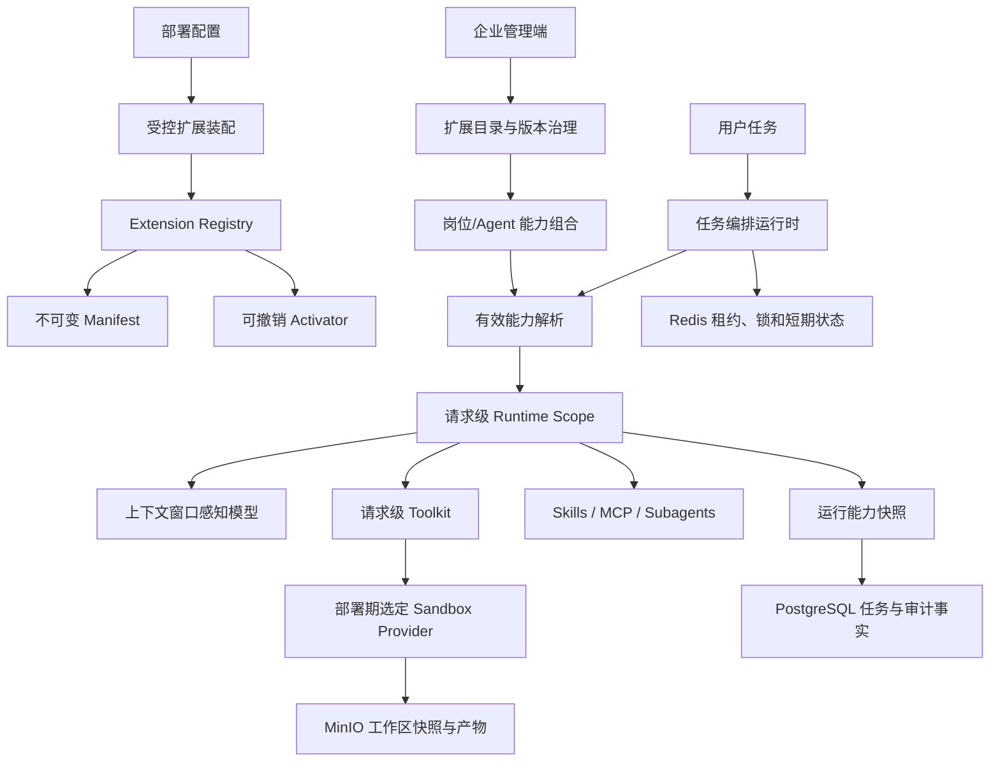
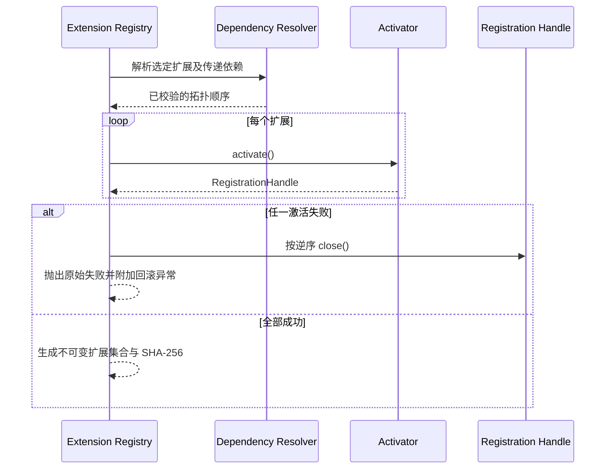

# 企业扩展运行时优化落地方案

## 1. 目标与原则

本方案借鉴 DeepSeek Harness 的插件思想，但不照搬其面向本地开发工具的进程内热加载方式。企业智能助手需要解决的是多租户并发、运行可重放、权限可审计和部署可控，因此扩展能力遵循以下原则：

1. 扩展代码只能在构建和部署阶段进入制品，租户配置不能指定任意 Java 类。
2. 用户侧只选择业务能力，不感知沙箱 Provider、扩展装载和版本切换。
3. 每次任务使用不可变的模型、工具、技能、MCP 和策略快照。
4. 扩展产生的运行时副作用必须可撤销；部分失败必须整体回滚。
5. 模型可见的工具必须与实际可执行工具完全一致，并写入运行记录。
6. PostgreSQL 保存权威配置和审计事实，Redis 只保存可重建的热状态，MinIO 保存文件与制品。
7. 领域规则位于 Domain/Application 层，持久化仅通过 Repository Port 和 MyBatis Adapter。

## 2. 借鉴范围

| DeepSeek Harness 思路 | 本项目决策 | 原因 |
|---|---|---|
| 插件清单、版本与依赖 | 采用 | 可以稳定标识能力并做依赖排序 |
| 插件效果可撤销 | 采用 | 防止工具、监听器和策略残留 |
| profile/bundle 组合能力 | 采用，作为管理配置 | 便于按岗位、环境和 Agent 分配能力 |
| 模型可见内容可追踪 | 采用 | 支持审计、问题复现和安全核查 |
| 任意模块进程内热加载 | 不采用 | 无法满足企业代码审核、类加载隔离和供应链要求 |
| 文件变化后热替换插件代码 | 不采用 | 多副本环境存在版本漂移和在途任务不一致 |
| 插件直接持有全局可变注册表 | 不采用 | 单例 Agent 服务多个租户时会产生越权和竞态 |

## 3. 总体架构

### 3.1 管理面

管理面维护扩展包、不可变版本、审核状态、岗位/Agent 能力组合及激活范围。发布后的版本不允许覆盖，只能发布新版本或撤销旧版本。生产环境只允许激活已审核、签名和制品摘要校验通过的版本。

### 3.2 运行面

运行面不在共享 Agent 上增删租户工具。每次请求根据组织、用户、Agent 和部署配置构造私有 Runtime Scope，模型展示、权限判断和工具执行始终从同一 Scope 读取能力。

### 3.3 执行面

Sandbox Provider 继续通过部署配置选择 Docker、OpenSandbox、E2B 或 CubeSandbox。扩展只能通过既有 Sandbox/Filesystem/MCP 接口执行外部动作，不能绕过权限引擎直接操作宿主机。

## 4. 扩展模型

### 4.1 Manifest

Manifest 至少包含：

- `id`：全局稳定标识；
- `version`：不可变语义版本；
- `dependencies`：按扩展 ID 声明的依赖；
- `contributionTypes`：TOOL、MCP、SKILL、MIDDLEWARE、SUBAGENT、SANDBOX_PROVIDER、MEMORY_PROJECTOR；
- 后续管理面字段：发布者、制品 URI、SHA-256、签名、最低平台版本和权限声明。

不允许 Manifest 声明任意类名、脚本启动命令或宿主机路径。具体实现由部署制品中的受控工厂绑定。

### 4.2 激活与回滚

Extension Registry 在执行任何副作用前完成缺失依赖和依赖环校验，再按拓扑顺序激活。每个 Activator 必须返回幂等 RegistrationHandle；激活失败时，已生效的贡献按逆序释放。

### 4.3 能力组合

后续的 Profile/Bundle 只保存“扩展版本集合 + 配置引用”，不复制扩展内容。解析优先级固定为部署基线、组织、岗位、Agent，个人只允许调整企业明确标记为可选的能力。冲突采用显式拒绝，不做静默覆盖。

## 5. 请求级隔离

### 5.1 问题

`HarnessAgent` 可以作为单例并发服务多个租户。原动态 MCP 机制在请求开始时修改共享 Toolkit，请求结束再删除工具，会产生以下风险：

- A 用户可能在并发窗口看到 B 用户的 MCP 工具；
- 模型生成工具调用后，共享 Toolkit 已被另一请求改变；
- 配置更新关闭 MCP Client 时，正在执行的请求会被中断；
- 动态工具过滤只影响展示或只影响执行，形成策略不一致。

### 5.2 方案

每个调用从平台 Toolkit 创建私有副本，在副本中注册租户 MCP 并应用 ToolFilter，然后把 `RuntimeToolScope` 写入 `RuntimeContext`。ReAct 循环在以下位置统一解析同一个 Toolkit：

1. 发送给模型的 ToolSchema；
2. acting 中间件事件；
3. PermissionEngine 工具查找；
4. 普通和流式工具调度；
5. 内部工具回调。

Runtime Scope 一经安装不得被不同配置哈希替换。MCP 配置变化时，新请求使用新 Client；旧 Client 进入 retired 集合，直到 Registry 关闭时统一释放，保证在途请求不被破坏。

## 6. 运行能力快照

每个 Agent Run 在第一次模型调用前保存一次不可变能力快照，包含：

- 模型名称及上下文窗口策略；
- 排序后的模型可见工具名；
- ToolSchema 哈希；
- 模型输入消息哈希；
- 扩展/动态 MCP 配置集合哈希；
- 已激活贡献的稳定标识。

数据库只允许同一个 Agent Run 首次写入，或者以相同哈希幂等重试；不同哈希再次写入必须失败。这样可以证明“模型看到什么、执行了什么、使用了哪个运行配置”，同时避免把完整敏感 Prompt 重复写入审计字段。

## 7. 持久化设计

### 7.1 权威数据

PostgreSQL 保存扩展包、不可变版本、激活关系、Profile/Bundle、运行快照和审计事件。所有租户表带 `org_id` 并启用 RLS。

建议后续表：

- `extension_packages`：稳定业务身份；
- `extension_versions`：不可变 Manifest、制品摘要和签名；
- `extension_activations`：组织/岗位/Agent 的激活版本和配置引用；
- `extension_profiles`、`extension_profile_items`：可复用能力组合；
- `agent_runs.runtime_capability_snapshot`：实际运行事实。

### 7.2 热状态与文件

- Redis：解析结果缓存、租约、分布式锁、短期健康状态，可清空重建；
- MinIO：扩展制品、用户文件、Agent 产物、沙箱快照，使用不同对象前缀和权限策略隔离；
- Sandbox 工作区：只保存本次运行所需的投影，不作为扩展目录和用户记忆的权威存储。

## 8. 安全边界

1. 扩展发布需要制品摘要、签名、发布者和审核人。
2. MCP、Skill 和 Tool 权限先取扩展声明与企业策略交集，再进入 Runtime Scope。
3. 密钥只保存凭据引用，运行时由密钥服务注入，不进入 Manifest、快照或日志。
4. MIDDLEWARE、SANDBOX_PROVIDER 和 MEMORY_PROJECTOR 属于高权限贡献，只能部署期启用。
5. 租户可配置内容必须经过结构化 Schema 校验，禁止表达式、类名和宿主机命令。
6. 扩展撤销只影响新任务；在途任务继续使用创建时的不可变快照，必要时由安全策略显式终止。

## 9. 分阶段实施

### P0：运行隔离与可追溯，已落地

- 请求级 `RuntimeToolScope`；
- ReAct 展示、权限和执行使用同一 Toolkit；
- 动态 MCP 不再修改共享 Toolkit；
- MCP Client 按配置指纹换代并保护在途请求；
- 可撤销 `RegistrationHandle`；
- Manifest、依赖排序、激活回滚和扩展集合哈希；
- Agent Run 能力快照及 PG/H2 Flyway 迁移；
- 跨用户工具隔离、回滚、依赖环和快照幂等测试。

### P1：企业扩展目录

- 按 DDD 建立扩展 Package、Version、Activation、Profile 聚合和 Repository Port；
- DAL 只使用 MyBatis，增加 RLS、唯一约束和乐观锁；
- 管理端完成新增版本、审核、撤销、激活和依赖预检；
- 将模型、MCP、Skill 市场的现有配置逐步投影为统一扩展目录；
- Profile Resolver 输出带哈希的不可变 EffectiveExtensionSet。

### P2：供应链与运营

- 企业 CA 签名验证、SBOM、漏洞扫描和许可证策略；
- 扩展健康检查、失败率、延迟和资源配额指标；
- 灰度发布、按环境晋级、快速回滚和配置变更审批；
- 多副本缓存失效事件和扩展目录灾备演练。

## 10. 验收标准

1. 100 个并发租户使用不同 MCP 配置时，模型可见工具和实际执行工具无交叉。
2. 同一 Run 内模型、工具和扩展集合哈希不可变化；重试可幂等恢复。
3. 任一扩展激活失败后，所有已安装贡献均按逆序释放。
4. 缺失依赖、依赖环、版本冲突在产生副作用前失败。
5. 配置切换不影响在途任务，新任务使用新版本。
6. 管理员可从运行记录还原模型名称、工具 Schema 和扩展版本集合。
7. 清空 Redis 不丢失扩展配置、运行事实、用户文件和 Agent 产物。
8. 扩展机制不改变部署时选择 Docker、OpenSandbox、E2B 或 CubeSandbox 的现有方式。

## 11. 代码落点

| 能力 | 模块与类型 |
|---|---|
| 可撤销注册 | `agentscope-core/.../extension/RegistrationHandle` |
| 扩展清单与类型 | `agentscope-core/.../extension/ExtensionManifest` |
| 依赖解析与回滚 | `agentscope-core/.../extension/ExtensionRegistry` |
| 请求级工具快照 | `agentscope-core/.../tool/RuntimeToolScope` |
| ReAct 一致性 | `agentscope-core/.../ReActAgent` |
| 动态 MCP 隔离 | `agentscope-harness/.../DynamicMcpMiddleware` |
| MCP Client 换代 | `agentscope-harness/.../McpClientRegistry` |
| 运行快照应用服务 | `agentscope-saas-app/.../OrchestrationGovernanceMiddleware` |
| DDD 持久化端口 | `agentscope-saas-domain/.../OrchestrationGovernanceRepository` |
| MyBatis Adapter | `agentscope-saas-dal/.../OrchestrationGovernanceMapper` |
| 数据库迁移 | `V30__runtime_capability_snapshots.sql` |
