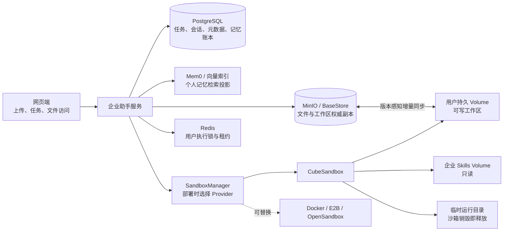

# CubeSandbox Volume 持久工作区优化方案

## 1. 决策摘要

CubeSandbox 生产部署采用“持久工作卷 + 权威远程存储”的双层方案：

- Cube Volume 是用户工作区的热数据盘，随用户保留，不随单次沙箱销毁。
- MinIO/BaseStore 是上传文件、生成文件及工作区投影的权威存储，供网页访问、审计、备份和跨 Provider 恢复。
- PostgreSQL 保存对话、任务、文件元数据、版本和结构化记忆；Mem0 仅作为个人记忆检索投影。
- Redis 只保存锁、租约和短期运行状态。
- 沙箱实例仍是可丢弃计算资源。父 Agent 与子 Agent 共享同一实例和同一工作卷。

该方案避免两种错误：一是每次任务都全量上传、下载工作区；二是把 Volume 变成唯一数据源，导致网页文件、审计和沙箱切换失去统一依据。

## 2. 数据分层

| 数据类型 | 权威存储 | Cube 中的形态 | 生命周期 |
|---|---|---|---|
| 对话、任务、事件、文件元数据 | PostgreSQL | 按需注入上下文 | 按企业保留策略 |
| 岗位档案、个人记忆账本 | PostgreSQL | 任务前检索后注入 | 岗位由企业维护，个人记忆可演进 |
| 个人记忆语义索引 | Mem0/向量索引 | 不直接挂载 | 可从 PG 重建 |
| 上传文件、生成文件、用户工作区投影 | MinIO/BaseStore | 增量同步到工作卷 | 权威、可审计、可跨 Provider 恢复 |
| `MEMORY.md`、`memory/`、私有 Skills、任务工作副本 | Cube Volume | 可写工作区 | 用户级持久热数据 |
| 企业公共 Skills | 只读 Cube Volume 或受控 hostPath | 只读挂载并覆盖到工作区 Skills | 企业发布版本管理 |
| 临时下载、缓存、中间产物 | 沙箱临时目录 | 不投影 | 随沙箱销毁 |

## 3. 总体架构



Provider 切换仅由部署配置决定，用户、任务规划器和子 Agent 不感知。Cube 使用 Volume 加速；其他 Provider 继续使用远程投影和快照恢复，不改变上层协议。

## 4. 资源生命周期

### 4.1 首次任务

1. `SandboxManager` 根据 `RuntimeContext` 获取企业与用户命名空间。
2. 使用命名空间 SHA-256 摘要生成稳定 Volume ID，不在基础设施名称中暴露企业号、用户号或邮箱。
3. 查询 `GET /volumes/{id}`；不存在时通过 `POST /volumes` 创建。并发创建采用查询、创建、再次查询的幂等流程。
4. 创建 Cube 沙箱时，把用户 Volume 以可写方式挂载到 `workspaceRoot`。
5. 读取 BaseStore 文件版本清单，只将远程存在且工作卷未同步的文件写入 Volume。
6. 执行任务。父 Agent 与子 Agent 从调用级 `RuntimeContext` 获得同一个沙箱。
7. 释放前扫描工作区，将变化文件批量投影到 BaseStore，并安全处理删除与并发修改。
8. 删除沙箱实例；不删除用户 Volume。

### 4.2 后续任务

Volume 已存在，创建新沙箱并直接挂载。同步器读取 Volume 内部清单与远程版本：

- 版本一致：不下载、不上传。
- 仅网页/接口侧变化：下载变化文件到 Volume。
- 仅沙箱侧变化：上传变化文件到 BaseStore。
- 两侧并发变化：保留网页侧权威文件，并将沙箱版本保存到 `/generated/conflicts/`，避免静默覆盖。
- 远程文件删除且版本未发生并发变化：从 Volume 删除。

Volume 内部同步清单位于 `/.agentscope/volume_sync_manifest.json`，不向用户文件列表投影。远程投影仍执行文件数、单文件大小和总容量限制。

### 4.3 释放与回收

- 正常任务结束、空闲淘汰和异常重建只释放沙箱计算实例。
- Volume 不能按沙箱 TTL 自动删除，否则会破坏用户持久工作区。
- 用户离职、租户注销或企业保留期到期时，由显式数据治理流程先确认 MinIO/PG 保留策略，再调用 Volume 删除能力。
- 公共 Skills Volume 由企业发布流程维护，不由用户工作区回收流程处理。

## 5. 隔离与安全

- 工作卷默认使用 `IsolationScope.USER` 对应的企业、用户命名空间，一名用户一个稳定工作卷。
- 匿名命名空间禁止创建持久工作卷，避免不同匿名请求共享数据。
- Volume ID 仅允许安全字符，挂载路径必须是非根绝对路径，所有挂载目标必须唯一。
- 工作区 Volume 必须可写并精确挂载到 `workspaceRoot`；企业 Skills Volume 必须只读。
- 用户请求不能提交 Volume ID、hostPath、驱动或挂载目标，所有值均由部署配置和服务端命名空间生成。
- Volume 创建或挂载失败时任务启动失败，不允许静默降级到空工作区。
- 工作区并发由现有用户级执行锁串行化；网页侧并发写入通过版本比较和冲突副本保护。

## 6. 快照与可移植性

当 Cube 工作区 Volume 启用时，不再对同一工作区执行完整 tar 快照恢复与上传，避免重复 I/O。BaseStore/MinIO 的文件投影承担跨节点、灾备和跨 Provider 基线。

以下场景仍保留原快照机制：

- Docker、E2B、OpenSandbox 等没有本方案持久工作卷能力的 Provider。
- Cube 工作区 Volume 未启用的兼容部署。
- 独立于用户文件投影、确需完整文件系统快照的特殊沙箱类型。

因此 Volume 是性能层而非数据锁定层。Cube 不可用或部署切换时，新 Provider 可从同一 BaseStore/MinIO 恢复用户文件。

## 7. 配置方案

启用用户持久工作卷：

```bash
SAAS_SANDBOX_TYPE=cube
SAAS_SANDBOX_CUBE_WORKSPACE_VOLUME_ENABLED=true
SAAS_SANDBOX_CUBE_WORKSPACE_VOLUME_NAME_PREFIX=agentscope-ws
# 可选；为空时使用 Cube 集群默认 Volume 驱动
SAAS_SANDBOX_CUBE_WORKSPACE_VOLUME_DRIVER=
```

使用只读公共 Skills Volume：

```bash
SAAS_SANDBOX_CUBE_COMMON_SKILLS_VOLUME_ID=enterprise-skills
SAAS_SANDBOX_CUBE_COMMON_SKILLS_MOUNT_PATH=/opt/agentscope-common-skills
SAAS_SANDBOX_CUBE_COMMON_SKILLS_TARGET_PATH=/home/user/skills
```

公共 Skills 的 Volume 与 hostPath 只能二选一。其他已存在的共享 Volume 可由部署级 JSON 声明：

```bash
SAAS_SANDBOX_CUBE_VOLUME_MOUNTS_JSON='[
  {"volumeId":"enterprise-datasets","mountPath":"/opt/datasets","readOnly":true}
]'
```

建议将 `PERSISTENT_WORKSPACE` 加入生产 Cube 部署的必需能力，启动时即可阻止错误配置：

```bash
SAAS_SANDBOX_REQUIRED_CAPABILITIES=PERSISTENT_WORKSPACE
```

## 8. 实现落点

本轮实现包含：

1. Harness 增加运行上下文感知的创建、恢复入口和持久工作区能力探测。
2. Cube 客户端实现 Volume 查询、幂等创建、挂载、状态序列化和显式删除。
3. Cube 工作卷按企业/用户命名空间确定性分配，旧沙箱状态可升级到 Volume 模式。
4. Cube 创建请求使用官方 `volumeMounts` 协议；沙箱启动后验证挂载目录。
5. 公共 Skills 支持只读 Volume 或 hostPath 两种部署来源。
6. 持久工作卷启用时禁用重复的完整 workspace 快照。
7. 远程文件投影增加版本清单、内容摘要、增量上下行、删除同步和并发冲突保护。
8. 部署能力注册 `PERSISTENT_WORKSPACE`，便于环境启动时校验。

## 9. 上线步骤与验收

1. 先升级并确认 CubeSandbox 0.7 及 Volume 后端可用，完成 Volume 创建、挂载和删除的集群级验证。
2. 在测试环境启用用户工作卷，保留 BaseStore/MinIO，执行上传、任务生成、释放、重新创建、网页下载闭环。
3. 验证公共 Skills Volume 只读、私有同名 Skill 优先、子 Agent 可读写父 Agent 工作区。
4. 模拟网页和任务同时修改同一文件，确认网页版本不被覆盖且生成冲突副本。
5. 模拟 Cube 实例丢失和 Provider 切换，确认可从 BaseStore/MinIO 恢复。
6. 对比优化前后的首任务与热启动：记录工作区文件数、实际同步文件数、同步字节数、沙箱创建耗时和任务首个工具调用耗时。
7. 小范围启用后再逐步扩大，不迁移匿名空间，不自动删除历史快照；稳定运行一个保留周期后再执行旧快照清理。

验收完成标准不是“Volume 挂载成功”，而是“沙箱可反复销毁重建、文件不丢失、热启动不再全量搬运、网页与 Agent 并发写入不静默覆盖、切换 Provider 仍可恢复”。
