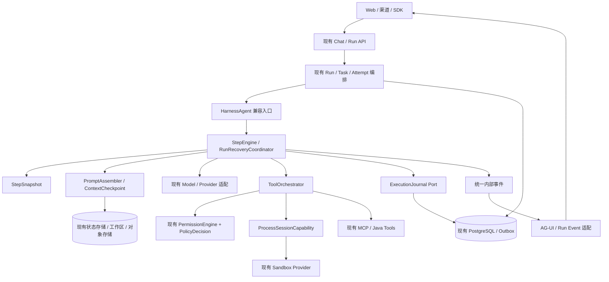

# Codex Harness 源码对比与 AgentScope Java 升级方案

分析日期：2026-09-08；状态核对：2026-09-09。本文保留升级前基线的源码分析与目标设计；部分工作已开始实施，当前实现及验证边界以 [升级实施记录](36-codex-harness-upgrade-progress.md) 为准。下文“现状”、问题行号和文件规模均描述分析基线，不代表修复后的工作树。

本报告比较的是用户提供的两个本地工作树，而非线上 Codex 产品的全部能力。Codex 基线为 `8e6a44b428e31f91b21edc97904fcdf4f0931ade`（2026-09-04）；本项目基线为 `8f43f141d0886f6aab64747c17ea75815aee3699`（2026-09-04）。对比覆盖 `agentscope-core`、`agentscope-harness`、`agentscope-saas`；不能只用裸 ReAct 与完整 Codex 比较。

主要依据是实现、调用路径和相关测试源码。没有运行两个项目的完整测试或同模型性能基准，因此文中的速度、成本改善均为待验证目标，不是实测结论。最初分析仅新增本报告；后续已进行局部代码升级和针对性测试，详见实施记录。工作区与本任务无关的文件保持原状。

## 1. 核心判断

**Codex 更值得借鉴的是执行内核中明确的状态边界、资源边界和故障语义。AgentScope Java 应在现有体系上升级这些机制，保留企业任务编排和 Provider 抽象。**

源码支持的主要差距有：

1. Codex 把每次模型请求需要的模型、权限、环境、MCP 连接和工具路由固定为 `StepContext`，并将它一直带到异步工具执行。本项目已有调用级工具隔离和首次模型调用的能力快照，可进一步细化到 Step。
2. Codex 的进程工具有可续接的进程会话、独立输出排空、有界缓冲、stdin、取消与审批联动。本项目 Harness 标准 Shell 工具主要是一次执行、一次返回。
3. Codex 把审批、沙箱选择、网络授权和沙箱拒绝后的重试放在统一执行管线。本项目相关能力已存在，但分布在 PermissionEngine、工具检查、Sandbox 和 SaaS 治理层。
4. Codex 的上下文管理覆盖环境差量、窗口状态、多模态估算、压缩检查点和宿主确认事实。本项目已有压缩和卸载，但预算边界、事实保留及恢复粒度仍有缺口。
5. Codex 有延迟工具发现和代码组合执行机制，可减少大工具集的上下文开销与模型往返；后者的启用条件和成熟度必须单独评估。

**不应据此宣称 Rust 必然比 Java 高效、Codex 的模型能力来自 Harness，或 Codex 比本项目更适合企业分布式服务。** 本项目的 Run/Task/Attempt、租约、Outbox、组织治理、工作区产物和完成验收已经形成另一组重要能力。

## 2. 已有能力：升级时应复用的基础

| 本项目已实现 | 源码依据 | 对方案的约束 |
|---|---|---|
| 调用级工具隔离，模型展示与执行共同解析私有 Toolkit | [RuntimeToolScope.java](/Users/family/Documents/workspace/agentscope-java-main/agentscope-core/src/main/java/io/agentscope/core/tool/RuntimeToolScope.java:20)、[DynamicMcpMiddleware.java](/Users/family/Documents/workspace/agentscope-java-main/agentscope-harness/src/main/java/io/agentscope/harness/agent/middleware/DynamicMcpMiddleware.java:44) | 继续扩展作用域，不能再以“缺少租户工具隔离”为由重建 |
| 首次模型调用前保存模型、工具 Schema、上下文和扩展集合哈希 | [OrchestrationGovernanceMiddleware.java](/Users/family/Documents/workspace/agentscope-java-main/agentscope-saas/agentscope-saas-app/src/main/java/io/agentscope/saas/app/orchestration/OrchestrationGovernanceMiddleware.java:108) | 增加 Step 级引用与版本，不另建不关联的审计体系 |
| 模型窗口、输出预留和安全余量 | [ModelContextProfile.java](/Users/family/Documents/workspace/agentscope-java-main/agentscope-core/src/main/java/io/agentscope/core/model/ModelContextProfile.java:20) | 改进估算与分配，而非新增一套重复窗口配置 |
| 压缩前预算检查、历史尾部保留、工具调用与结果配对、大结果卸载 | [CompactionMiddleware.java](/Users/family/Documents/workspace/agentscope-java-main/agentscope-harness/src/main/java/io/agentscope/harness/agent/middleware/CompactionMiddleware.java:76)、[ConversationCompactor.java](/Users/family/Documents/workspace/agentscope-java-main/agentscope-harness/src/main/java/io/agentscope/harness/agent/memory/compaction/ConversationCompactor.java:279) | 现有 compactor 可作为默认实现，增强输入输出契约 |
| 并行工具批次、非并发安全工具串行隔离、结果顺序保留 | [ToolExecutor.java](/Users/family/Documents/workspace/agentscope-java-main/agentscope-core/src/main/java/io/agentscope/core/tool/ToolExecutor.java:308) | 缺口是副作用分类、资源冲突和跨故障重试，不是“没有并行工具” |
| 工具权限、参数安全检查及 Docker 网络默认关闭、只读挂载选项 | [PermissionEngine.java](/Users/family/Documents/workspace/agentscope-java-main/agentscope-core/src/main/java/io/agentscope/core/permission/PermissionEngine.java:132)、[DockerSandbox.java](/Users/family/Documents/workspace/agentscope-java-main/agentscope-harness/src/main/java/io/agentscope/harness/agent/sandbox/impl/docker/DockerSandbox.java:525) | 保留 Provider 限制，补统一策略投射和能力校验 |
| 持久化 Run、子任务、租约心跳、过期回收、可靠通知 | [RunOrchestrationService.java](/Users/family/Documents/workspace/agentscope-java-main/agentscope-saas/agentscope-saas-orchestration/src/main/java/io/agentscope/saas/orchestration/RunOrchestrationService.java:42)、[DurableTaskLeaseService.java](/Users/family/Documents/workspace/agentscope-java-main/agentscope-saas/agentscope-saas-app/src/main/java/io/agentscope/saas/app/orchestration/DurableTaskLeaseService.java:64)、[OrchestrationOutboxPublisher.java](/Users/family/Documents/workspace/agentscope-java-main/agentscope-saas/agentscope-saas-app/src/main/java/io/agentscope/saas/app/orchestration/OrchestrationOutboxPublisher.java) | PostgreSQL 继续保存权威事实，不能改成进程内任务表或本地 JSONL 调度 |
| 模型首输出前重试/故障转移，SaaS 部分输出中断后继续回合 | [ResilientModel.java](/Users/family/Documents/workspace/agentscope-java-main/agentscope-core/src/main/java/io/agentscope/core/model/ResilientModel.java:63)、[SaasChatController.java](/Users/family/Documents/workspace/agentscope-java-main/agentscope-saas/agentscope-saas-app/src/main/java/io/agentscope/saas/app/chat/SaasChatController.java:487) | 将恢复语义下沉并持久化，而非删除已有防重复逻辑 |
| 验收契约、证据和产物引用检查 | [CompletionGate.java](/Users/family/Documents/workspace/agentscope-java-main/agentscope-saas/agentscope-saas-orchestration/src/main/java/io/agentscope/saas/orchestration/CompletionGate.java) | 保留完成门槛；证据内容真实性校验是后续增强 |

现有 [19 运行编排方案](/Users/family/Documents/workspace/agentscope-java-main/docs/enterprise-platform-java/19-runtime-orchestration-optimization-plan.md)、[23 扩展运行时方案](/Users/family/Documents/workspace/agentscope-java-main/docs/enterprise-platform-java/23-enterprise-extension-runtime-plan.md)、[34 模型流恢复方案](/Users/family/Documents/workspace/agentscope-java-main/docs/enterprise-platform-java/34-model-stream-recovery-design.md) 继续作为已有方向的基础。本文补充执行内核层，不要求重新建设上述能力。

## 3. Codex 先进机制与本项目具体差距

### 3.1 从调用级作用域细化到每次模型请求的执行快照

**Codex 实现。** [StepContext](/Users/family/Documents/workspace/codex/codex-rs/core/src/session/step_context.rs:15) 同时持有不可变设置版本、预算、环境快照、能力根目录、MCP Binding、ToolRouter 和 AGENTS.md 观察值。[ToolCallRuntime](/Users/family/Documents/workspace/codex/codex-rs/core/src/tools/parallel.rs:47) 保留生成该工具调用时的 Step，防止异步执行期间路由漂移。

**本项目现状。** `RuntimeToolScope` 已固定调用级 Toolkit 选择，但内部仍暴露 Toolkit 引用；`OrchestrationGovernanceMiddleware` 通过 `RuntimeCapabilityCaptured` 只捕获第一次模型调用，后续工具组激活、模型切换及上下文变化没有同等粒度的快照记录。当前 `ReActAgent.CallExecution` 承担一次调用内的主要状态流转。

**升级。** 引入 `StepSnapshot`，在模型请求提交前解析并冻结：模型实际路由、Schema 集合、可执行句柄、权限版本、沙箱环境、Prompt 版本、预算、父 Run/Task/Attempt 标识。模型展示、审批和执行必须引用同一个 `stepId`。工具激活只影响下一 Step；权限撤销作为紧急收紧信号可中止在途操作，不能因快照存在而继续使用已撤销授权。

**收益边界。** 主要改善并发一致性、问题复现和扩展升级时的可追踪性，不能仅凭此认定性能提升。首次能力快照继续保留，Step 保存增量和引用，避免重复存储完整 Prompt。

### 3.2 工具执行更接近流式任务调度

**Codex 实现。** [turn.rs](/Users/family/Documents/workspace/codex/codex-rs/core/src/session/turn.rs:2383) 在完整 `OutputItemDone` 到达时处理工具调用并维护 in-flight 队列；[parallel.rs](/Users/family/Documents/workspace/codex/codex-rs/core/src/tools/parallel.rs:155) 用共享/独占锁约束并行能力，取消路径也产出明确的工具终态。

**本项目现状。** [ReActAgent](/Users/family/Documents/workspace/agentscope-java-main/agentscope-core/src/main/java/io/agentscope/core/ReActAgent.java:1850) 先消费模型流、构造最终消息，再进入 acting；`ToolExecutor` 随后按批执行，已经支持并行安全分组。这个设计更简单，也让当前部分流恢复有清晰的“工具尚未开始”边界。

**升级。** 先增加工具执行元数据和终态归一化，再试点“完整调用项提前调度”：仅对 Provider 能可靠标记完成的调用项启用，首先覆盖无副作用读取。模型传来半截参数时绝不执行。文件写入、外部动作必须在执行日志与恢复语义完成后才能纳入；工具间有依赖时保持顺序。

不要把这一优化简化成把 `concatMap` 改成 `flatMap`。否则模型流失败时，原先“没有执行过工具”的恢复前提会被破坏。

### 3.3 可续接的进程会话与资源控制

**Codex 实现。** [unified_exec/mod.rs](/Users/family/Documents/workspace/codex/codex-rs/core/src/unified_exec/mod.rs:1) 明确管理 PTY、进程复用、yield、stdin、输出上限、取消及审批；[process.rs](/Users/family/Documents/workspace/codex/codex-rs/core/src/unified_exec/process.rs:60) 将输出排空、缓冲和消费者通知分离。源码中存在 1 MiB 输出缓冲及 64 个进程上限，这是其实现参数，不应直接作为本项目生产默认值。

**本项目现状。** [ShellExecuteTool](/Users/family/Documents/workspace/agentscope-java-main/agentscope-harness/src/main/java/io/agentscope/harness/agent/tool/ShellExecuteTool.java:46) 接口为 command、working_directory、timeout，返回一次性字符串；标准接口不能对一个仍在运行的命令继续读写。Docker 后端已并发排空 stdout/stderr，不能将本地后端的问题泛化到所有 Provider。

**升级。** 在现有 Sandbox SPI 上增加可选 `ProcessSessionCapability`，提供 `start/poll/writeStdin/terminate`；统一 `ProcessHandle`、输出游标、状态、截止时间和退出信息。默认保持现有 `execute` 兼容接口，由其等待新进程接口的完成结果。Provider 不支持 PTY 时声明能力，支持普通 pipe 会话即可。

进程输出持续读取，内存只保留有界头尾和近期片段；完整日志走现有对象存储或工作区文件。超时和取消必须能终止实际进程树，不能仅取消等待它的 Reactor 订阅。Docker CLI 进程退出并不自动证明容器内命令已终止，需要 Provider 级终止标识与验证。

### 3.4 审批、策略和沙箱执行形成统一管线

**Codex 实现。** [ToolOrchestrator](/Users/family/Documents/workspace/codex/codex-rs/core/src/tools/orchestrator.rs:125) 统一确定审批要求、执行环境与沙箱策略，并处理受限执行被拒后的后续动作；[execpolicy](/Users/family/Documents/workspace/codex/codex-rs/execpolicy/README.md:1) 提供基于参数 token 的前缀规则、可执行文件身份与规则示例校验。网络审批、文件访问和操作系统执行约束都有明确接口。

**本项目现状。** `PermissionEngine` 已有 deny/ask/tool-specific/mode 等检查，`ToolInputSecurityGuard` 检查危险参数；Docker 默认 `--network=none`，支持只读挂载。因此差距不是“没有沙箱”，而是缺少跨工具、跨 Provider 的统一执行策略协议。本地 `LocalFilesystemWithShell` 直接调用宿主机 shell，文件系统对象的路径限制不能自动约束其子进程。

**升级。** 增加 `ToolInvocationPlan` 和 `PolicyDecision`，形成“解析参数 → 规范化资源 → 解析策略 → 绑定审批 → 验证 Provider 能力 → 执行 → 记录终态”的唯一入口。审批绑定工具名、规范化参数摘要、cwd、权限版本、有效范围及过期时间；stdin 续写也经过同一策略入口。

策略以结构化 argv、路径和网络目标表达；shell 解析无法可靠理解的情况保守处理，保留现有 deny 规则。沙箱拒绝后的重试只允许发生在策略授权范围内，不能在企业 Worker 上自动切换成无限制宿主执行。Provider 无法实现的限制返回明确拒绝或改用合适的执行环境。

### 3.5 上下文预算覆盖内容类型、变更和硬边界

**Codex 实现。** [ContextWindowTokenStatus](/Users/family/Documents/workspace/codex/codex-rs/core/src/session/context_window.rs:8) 区分整个活动上下文与自动压缩窗口；[WorldState](/Users/family/Documents/workspace/codex/codex-rs/core/src/context/world_state/mod.rs:66) 为不同环境片段提供 snapshot/render_diff；[history.rs](/Users/family/Documents/workspace/codex/codex-rs/core/src/context_manager/history.rs:736) 估算各类内容，另有图片估算路径。它也使用估算，不能描述成完全精确计数。

**本项目现状。** 已有 `contextWindow - maxOutput - safetyMargin` 预算和压缩前校验。但 [TokenCounterUtil](/Users/family/Documents/workspace/agentscope-java-main/agentscope-harness/src/main/java/io/agentscope/harness/agent/memory/compaction/TokenCounterUtil.java:49) 使用统一字符比例，图片/音频等仅计极小固定开销；[WorkspaceContextMiddleware](/Users/family/Documents/workspace/agentscope-java-main/agentscope-harness/src/main/java/io/agentscope/harness/agent/middleware/WorkspaceContextMiddleware.java:151) 拼装 AGENTS、知识目录、附加内容和记忆，仅在 `available > 0` 时裁剪记忆。固定内容已耗尽预算时，记忆也没有因此归零。

**升级。** 引入 `PromptAssembler` 和有类型的 `ContextFragment`：每个片段带 source、版本、优先级、估算 token、字节上限、可裁剪方式、稳定性和保留策略。使用实际 Provider 格式估算 Schema/图片/音频；有官方 tokenizer 或服务端计数能力时适配，没有时保守估算并利用返回 usage 校准。

整个最终请求必须经过一次统一预算检查，包括系统内容、动态工具、检索内容、媒体和输出预留。强制策略内容放不下时明确失败，不能静默裁掉安全要求。大知识目录分页检索，不全文列出所有路径；大结果按模型预算决定卸载，不能只依赖固定 80,000 字符阈值。

稳定基础指令使用固定排序和序列化；环境变化用有版本的差量表达，并明确何时需要替换失效内容。单纯每次重新拼接相同字符串未必破坏缓存，真正需要消除的是内容、顺序和前缀位置的不必要变化。

### 3.6 压缩检查点与可信事实保留

**Codex 实现。** [RetainedContext](/Users/family/Documents/workspace/codex/codex-rs/history/src/retained_context.rs:1) 在模型摘要之外保存宿主验证过的用户问答，具有容量上限、幂等记录和不完整证据标记；[record_retained_context](/Users/family/Documents/workspace/codex/codex-rs/core/src/session/retained_context.rs:10) 与检查点使用同一持久化锁。[rollout_reconstruction](/Users/family/Documents/workspace/codex/codex-rs/core/src/session/rollout_reconstruction.rs:343) 选择有效检查点并重放后缀，处理回滚对历史与保留事实的影响。

这里的源码事实是“保留宿主确认问答”，不是“Codex 已将所有目标、权限和业务结果都结构化存储”。

**本项目现状。** `AgentState` 已独立保存 permission/task/plan 等状态，但 [summary](/Users/family/Documents/workspace/agentscope-java-main/agentscope-core/src/main/java/io/agentscope/core/state/AgentState.java:43) 仍为自由文本；compactor 生成 summary user message 加保留尾部。不能将权限状态已经独立保存的事实遗漏。

**升级。** 新增有界 `RetainedFacts`，首先纳入用户明确确认的约束、待解决问题、完成验收条件和证据引用；为事实保存来源事件、版本、撤销关系和完整性标志。权限授权继续由权限状态和审批记录负责，不能由摘要推断产生。

`ContextCheckpoint` 关联 history revision、摘要、保留尾部、可信事实版本、工具未决状态及工作区版本。压缩保留工具调用/结果配对、未决审批和当前任务目标；恢复时检查这些记录属于同一有效历史。长期记忆仍走已有体系，不把一次任务的执行状态直接写成永久个人记忆。

### 3.7 恢复内核与企业持久化编排衔接

**Codex 实现。** [responses_retry.rs](/Users/family/Documents/workspace/codex/codex-rs/core/src/responses_retry.rs:44) 在内核统一处理采样和压缩的重试、连接问题与传输回退，历史恢复也位于内核。其本地 rollout/checkpoint 不等同于本项目的分布式任务与租约系统，也不能据此声称外部副作用获得 exactly-once。

**本项目现状。** 部分模型流恢复位于 `SaasChatController`，次数、退避和转换器重置保存在这条进程内调用链中；`HarnessDurableTaskExecutor` 是另一条入口。正常 AgentState 保存见 [saveStateToSession](/Users/family/Documents/workspace/agentscope-java-main/agentscope-core/src/main/java/io/agentscope/core/ReActAgent.java:423) 和 [doCall](/Users/family/Documents/workspace/agentscope-java-main/agentscope-core/src/main/java/io/agentscope/core/ReActAgent.java:934)，另有优雅停机与 pending tool 恢复路径，但这不构成每次外部动作的持久化提交日志。

**升级。** 将入口无关的恢复分类提取为 `RunRecoveryCoordinator`，Controller 只负责协议映射。基于已有 Attempt/lease 增加恢复阶段、原因、次数、下次执行时间和检查点引用；新增工具操作日志 Port，并接入已有 Repository/Outbox 体系。

关键契约：模型请求失败可重采样；只读工具可按策略重试；幂等外部 API 使用业务操作 ID；副作用结果未知时进入 `RECONCILING` 或人工处理，禁止把“没有记录到成功”解释为“可以再做一次”。租约只能阻止过期 Worker 提交内部状态，外部系统也需要幂等键、fencing 或结果核验。

### 3.8 延迟工具发现与可选 Code Mode

**Codex 实现。** [ToolSearchHandler](/Users/family/Documents/workspace/codex/codex-rs/core/src/tools/handlers/tool_search.rs:28) 对 deferred 工具描述构建 BM25 索引并缓存；[spec_plan.rs](/Users/family/Documents/workspace/codex/codex-rs/core/src/tools/spec_plan.rs:1402) 仍有搜索执行器注册路径。工具目录、可展示 Schema 与实际执行器有不同职责。

[Code Mode 协议](/Users/family/Documents/workspace/codex/codex-rs/code-mode-protocol/src/runtime.rs:20) 提供 enabled_tools、执行代码、输出预算及 yielded cell；[V8 模块执行器](/Users/family/Documents/workspace/codex/codex-rs/code-mode-runtime/src/runtime/module_loader.rs:9) 支持模块求值和 Promise。该机制能让一次模型调用表达多个工具调用及结果聚合。

**本项目现状。** `ToolGroupManager` 已支持工具组激活，`DynamicMcpMiddleware` 已建立请求级工具集合。差距是面向大目录的细粒度检索加载和可控组合执行，不能将 MCP 本身列为缺失。

**升级顺序。** 先实现租户与岗位权限过滤后的 `ToolCatalog → tool_search → load → 下一 Step 固定 Schema`，保留关键基础工具常驻。搜索不能泄露其他租户的工具描述，命中也不自动获得执行权限；中文描述需要适配分词或混合检索，不能直接复制英语 BM25 参数。

随后以独立进程或现有沙箱中的受限运行时试点 Code Mode。宿主仅暴露授权工具代理、有限数据处理和输出接口；每个子调用仍生成日志并执行策略校验。限制 CPU、内存、总时长、并发、递归深度和输出，禁止通过脚本获得任意 Java 宿主对象或绕过工具网关。

**成熟度核查。** [features/lib.rs](/Users/family/Documents/workspace/codex/codex-rs/features/src/lib.rs:996) 中 `CodeMode` 为 UnderDevelopment 且默认关闭，`CodeModeHost` 为 Stable 且默认开启；二者不代表同一功能开关。`RemoteCompactionV2` 为 Stable 且默认开启；`MultiAgentV2` 为 Stable 但默认关闭。旧 `ToolSearch` 标志标记 Removed，但当前搜索执行器代码仍被引用，不能由旧标志直接推断搜索功能已删除。以上仅描述本地快照，不能推断所有用户的产品配置。

### 3.9 运行中的输入、事件协议与回归体系

**Codex 实现。** [turn_input.rs](/Users/family/Documents/workspace/codex/codex-rs/core/src/session/turn_input.rs:199) 明确区分 StartOrSteer、StartIfIdle 和指定 expected_turn_id 的 Steer；[input_queue.rs](/Users/family/Documents/workspace/codex/codex-rs/core/src/session/input_queue.rs:122) 管理 mailbox 投递与接收。[app-server 协议](/Users/family/Documents/workspace/codex/codex-rs/app-server/README.md:63) 有过载响应、可生成的 Schema 和 Thread/Turn/Item 生命周期。

**本项目现状。** 已有显式 session interrupt、Gateway 会话串行 gate、后台子任务通知、AG-UI 事件和持久化 Run 事件。[SessionTurnGate](/Users/family/Documents/workspace/agentscope-java-main/agentscope-harness/src/main/java/io/agentscope/harness/agent/gateway/SessionTurnGate.java:26) 解决互斥，但互斥本身不定义“这条新输入修改当前工作，还是开启下一回合”。

**升级。** 新增 `SubmitInput(mode, expectedTurnId, idempotencyKey)`：区分排队、纠偏、取消和审批回答；纠偏在明确的 Step 安全点进入。子任务结果也携带来源、投递 ID 与消费状态。沿用 AG-UI 外部协议，用统一内部事件补充 Run/Attempt/Step/Item 关联、序号、恢复原因和版本，并保持旧客户端可读。

回归测试重点是组合行为。Codex 的 [tool_parallelism](/Users/family/Documents/workspace/codex/codex-rs/core/tests/suite/tool_parallelism.rs)、[compact_resume_fork](/Users/family/Documents/workspace/codex/codex-rs/core/tests/suite/compact_resume_fork.rs)、[unified_exec_process_events](/Users/family/Documents/workspace/codex/codex-rs/core/tests/suite/unified_exec_process_events.rs) 可作为场景设计参考。本项目已有压缩、MCP 隔离、租约、流事件测试，应在其基础上增加断流/崩溃/取消/压缩/热更新交叉场景，而不是以测试文件数量评价成熟度。

## 4. 应优先落地的具体问题

这里的 P0 指本次升级的正确性优先项。涉及本地后端的风险按启用范围处理，不代表所有 SaaS 部署均受影响；下列问题来自静态路径分析，尚未执行故障复现。

| ID | 源码事实与影响 | 修复方向 | 必须覆盖的验证 |
|---|---|---|---|
| P0-01 | [LocalFilesystemWithShell.java:334](/Users/family/Documents/workspace/agentscope-java-main/agentscope-harness/src/main/java/io/agentscope/harness/agent/filesystem/local/LocalFilesystemWithShell.java:334) 先 waitFor，再 readAllBytes，最后才在超时分支 destroy。大输出可能填满管道；未退出的进程也可能使超时后的读取继续阻塞 | 并发持续排空两条流；有界缓冲；超时先终止进程树，再有限等待排空；取消清理走统一路径 | stdout/stderr 同时大量输出、持续进程、超时、取消、子进程继承管道，均在规定时间返回且无残留 |
| P0-02 | [ShellExecuteTool.java:60](/Users/family/Documents/workspace/agentscope-java-main/agentscope-harness/src/main/java/io/agentscope/harness/agent/tool/ShellExecuteTool.java:60) 把 working_directory 拼入 `cd … && command`，路径内容被解释为 shell 语法，且含空格路径可改变命令含义 | 把 cwd 作为结构化执行参数，统一规范化并验证根目录；兼容期必要的 shell 拼接采用可靠转义 | 含空格、引号、分号、换行、相对路径及越界路径，审批对象与实际执行参数一致 |
| P0-03 | [WorkspaceContextMiddleware.java:161](/Users/family/Documents/workspace/agentscope-java-main/agentscope-harness/src/main/java/io/agentscope/harness/agent/middleware/WorkspaceContextMiddleware.java:161) 固定内容占满预算时不裁剪记忆，固定片段也缺少统一总量裁剪；压缩会话无法解决系统内容本身过大 | available 使用非负预算；按片段分配；对最终请求验证；重要指令放不下时明确拒绝或降载 | AGENTS、知识目录、附加文件、MEMORY 分别或组合超限；边界 0/负值；小窗口模型 |
| P0-04 | [TokenCounterUtil.java:160](/Users/family/Documents/workspace/agentscope-java-main/agentscope-harness/src/main/java/io/agentscope/harness/agent/memory/compaction/TokenCounterUtil.java:160) 对图片/音频只计极小固定开销，多模态请求预算可能严重低估 | Provider 感知媒体预算；无法计数时使用保守上限或限制输入；输出预留共同计入 | 多图、高分辨率、音频、媒体与大 Schema 混合输入，发送前决策明确 |
| P0-05 | [ToolExecutor.java:432](/Users/family/Documents/workspace/agentscope-java-main/agentscope-core/src/main/java/io/agentscope/core/tool/ToolExecutor.java:432) 配置开启重试后，没有自定义 retryOn 时会匹配所有异常；此处未依据副作用或幂等声明区分 | 新增 retrySafety；非幂等/未知效果默认不自动重放；支持带业务操作 ID 的幂等重试 | “外部已成功、响应丢失”不重复副作用；权限、参数、取消错误不重试；两次合法同参操作仍可分别执行 |

P0-05 不表示所有工具默认都会重试：`maxAttempts` 未配置或不大于 1 时，该路径直接返回。应优先审计实际启用多次尝试的配置与工具。

## 5. 目标架构及模块边界



| 放置位置 | 建议新增或改造 | 保持的边界 |
|---|---|---|
| `agentscope-core` | Step/Invocation DTO、执行元数据、重试分类、事件契约；逐步从 ReActAgent 提取 ModelStepRunner/ToolStepRunner | 不依赖 Spring、PostgreSQL、Redis、具体沙箱 SDK |
| `agentscope-harness` | PromptAssembler、ContextFragment、RetainedFacts、进程会话 SPI、Harness 运行适配 | 复用 WorkspaceManager、Sandbox、middleware；保留现有 builder |
| `agentscope-saas-orchestration` | 持久化恢复状态、操作提交规则、上下文检查点关联、纠偏/投递语义 | 扩展现有 Run/Task/Attempt 领域，不复制一套 Run |
| `agentscope-saas-domain/dal` | Journal/Checkpoint Repository Port 与 MyBatis 实现 | 数据结构沿用现有迁移、组织隔离、事务与 Outbox 规范 |
| `agentscope-saas-app` | 装配、API/AG-UI 映射、Worker 接入、指标 | 将当前 Controller 中通用恢复逻辑抽出 |
| Sandbox 扩展模块 | 进程操作、能力声明、策略投射、终止确认 | Provider 可选能力显式暴露；支持能力不足时明确失败 |

上述位置均为逻辑分层建议。优先在现有模块中建立 package 边界，只有出现清晰复用需求再新增 Maven 模块。当前 `ReActAgent.java` 为 4,436 行、`HarnessAgent.java` 为 2,401 行，是提取职责的信号；Codex 自身也在 [codex-tools README](/Users/family/Documents/workspace/codex/codex-rs/tools/README.md:1) 中明确仍在渐进拆分，不能照搬其目录就视为完成架构升级。

### 5.1 最小核心契约

以下名称是拟议接口，不是已存在的代码。

| 契约 | 最小信息 | 关键约束 |
|---|---|---|
| StepSnapshot | runId/taskId/attemptId/stepId、modelRoute、toolSetVersion、policyVersion、environmentVersion、promptHash、budget | Step 内不可变；可执行句柄与展示 Schema 一致 |
| ToolExecutionTraits | sideEffect、retrySafety、resourceScope、supportsCancel、supportsStreaming | 线程安全、无副作用、业务幂等分别声明，不能混用一个 concurrencySafe |
| ToolInvocationPlan | operationId、invocationId、stepId、规范化参数、策略决策、审批引用 | operationId 标识一次业务意图，重试沿用；用户再次执行相同参数使用新 ID |
| ProcessHandle | tenant/owner、environmentId、processId、outputCursor、deadline、status | 不跨租户复用句柄；游标单调；进程终止与超时可核验 |
| ContextCheckpoint | historyRevision、stepId、summary、retainedFactsVersion、pendingOperations、workspaceVersion | 通过同一提交边界关联；不得拼接不同历史分支的记录 |
| RuntimeEvent | schemaVersion、runId/attemptId/stepId/itemId、sequence、type、timestamp、payload | 终态幂等；断线重放不重新执行工具；兼容旧 AG-UI |

### 5.2 工具日志与恢复原则

```text
PREPARED → WAITING_APPROVAL → AUTHORIZED → RUNNING → SUCCEEDED
                    ↘ DENIED              ↘ FAILED
                                         ↘ CANCELLED
                                         ↘ OUTCOME_UNKNOWN → RECONCILING
```

1. 先保存执行意图、规范化参数摘要、策略版本与业务操作 ID，再开始有副作用的工具；具体事务接入沿用现有 Repository/Outbox。
2. 工具完成时将结果或结果引用、usage、终态与对应事件一致提交。检查点只引用已经提交的结果。
3. Worker 失联时，lease 失效不代表外部动作失败。恢复 Worker 先对账，再决定复用结果、重试或交由人工。
4. 外部 API 支持幂等键时透传同一 operationId；不支持时通过结果查询、版本检查或补偿策略解决。不能承诺对任意 shell/API 实现 exactly-once。
5. 进程会话只承诺在 Provider 支持的生命周期内续接。Worker/沙箱销毁后，无法恢复的进程状态必须显式标记，不能伪造为仍在运行。

## 6. 分阶段实施计划

排期假设：3 名后端、1 名测试，前端阶段性参与；团队熟悉 Reactor、现有编排与沙箱。**主干升级预估 10–14 周，Code Mode 另设 2–4 周验证窗口。** 工期是设计估算，应由首阶段的失败场景和接口验证重新校准。

| 阶段 | 时间窗口 | 交付范围 | 出阶段条件 |
|---|---|---|---|
| A：建立基线并修正确性 | 第 1–2 周 | P0-01～05；统一观测字段；选取代表性 Provider；记录延迟/token/恢复现状 | 本地输出与超时无阻塞；cwd 无语法混淆；预算超限可控；危险重试被抑制 |
| B：统一 Step 与策略 | 第 3–5 周 | StepSnapshot、traits、ToolInvocationPlan、ToolOrchestrator；请求级 Scope 兼容接入 | 热更新、工具激活、并行请求下，展示/审批/执行版本一致；策略能力不足时拒绝 |
| C：持久化恢复与进程能力 | 第 6–8 周 | Journal、Checkpoint、RunRecoveryCoordinator；Worker 与 Chat 统一接入；至少一个生产 Provider 支持进程会话 | 对指定崩溃点恢复成功或进入明确对账状态；副作用不盲目重放；取消能够清理实际进程 |
| D：上下文、工具发现和交互 | 第 9–11 周 | ContextFragment、RetainedFacts、工具搜索/加载、纠偏输入、版本化事件适配 | 压缩/恢复后约束和审批事实正确；工具发现不越权；新输入投递不丢失、不串回合 |
| E：灰度和性能优化 | 第 12–14 周 | 多租户回归；Provider 契约验证；只读调用项提前执行试点；灰度开关和回滚演练 | 同模型基准验证收益；未回归正确性与完成率；旧会话可读取，旧客户端可继续使用 |
| F：可选 Code Mode | 主干稳定后 2–4 周 | 受限组合执行；调用网关；配额和终止；企业任务 A/B | 组合执行有可量化收益，且每个子调用可审计、受策略控制；否则保持试验功能 |

上下文预算修复不依赖完整 Step 引擎，可在阶段 A 独立交付。完整调用项提前执行必须依赖阶段 B/C，不能为了缩短延迟先破坏恢复边界。

### 6.1 可拆分的实施任务

| 工作项 | 主要修改点 | 依赖 | 验收重点 |
|---|---|---|---|
| H01 本地命令输出与取消修复 | LocalFilesystemWithShell、共享输出缓冲 | 无 | 两条输出流持续排空、超时和取消不挂起 |
| H02 结构化 cwd | ShellExecuteTool、Sandbox/Filesystem 执行请求 | H01 可并行 | 路径语义一致，兼容旧工具参数 |
| H03 预算与多模态估算 | WorkspaceContextMiddleware、TokenCounterUtil、CompactionMiddleware | 无 | 零/负剩余预算、媒体、Schema、大目录 |
| H04 工具副作用与重试分类 | ToolBase/工具适配、ToolExecutor、ExecutionConfig | 无 | 非幂等与未知结果不自动重放，旧配置迁移有提示 |
| H05 StepSnapshot 与运行版本关联 | ReActAgent、RuntimeToolScope、GovernanceMiddleware | H03/H04 | 每次请求和执行都指向同一快照 |
| H06 统一策略与 Provider 能力矩阵 | PermissionEngine、ToolOrchestrator、Sandbox SPI | H02/H05 | 参数、cwd、网络、stdin、审批引用一致 |
| H07 工具日志与检查点 Port/适配 | orchestration、domain/dal、现有 Outbox | H05/H06 | 重放、重复提交、失效 lease、未知结果 |
| H08 通用流恢复 | Controller、HarnessDurableTaskExecutor、RecoveryCoordinator | H07 | Chat/Worker 同一恢复语义；退避期间重启可恢复 |
| H09 进程会话 | Sandbox SPI、生产 Provider、Shell 工具 | H06/H07 | start/poll/stdin/terminate、输出游标及配额 |
| H10 上下文片段与事实保留 | compactor、WorkspaceContext、AgentState 版本适配 | H03/H07 | 多次压缩后约束、证据和工具配对保持正确 |
| H11 工具搜索与延迟加载 | Toolkit/ToolGroup、DynamicMcp、Step 捕获 | H05/H10 | 大目录减少 Schema；描述和结果均不越权 |
| H12 输入纠偏和事件适配 | Gateway、Run API、AG-UI、前端 | H05/H08 | stale expectedTurnId 被拒；投递去重与取消终态 |
| H13 完整调用项提前执行 | Provider 事件归一化、ModelStepRunner、ToolStepRunner | H04/H07/H08 | 部分参数不执行；断流后不重复已执行调用 |
| H14 Code Mode 试点 | 独立受限运行时、工具代理 | H06/H07/H11 | 脚本无法绕过权限或配额；收益可测 |

每个工作项可继续拆成 API/适配/测试几份小 PR。公共 API 使用新增重载和默认实现，避免强迫全部第三方工具或 Sandbox Provider 同时迁移。

## 7. 验证指标与对比方法

### 7.1 正确性门槛

以下“为 0”是确定性测试集的验收门槛，不是对生产绝对零故障的承诺。

| 维度 | 验收目标 | 方法 |
|---|---|---|
| 工具副作用 | 注入故障的测试中，重复副作用为 0；未知结果明确进入对账状态 | 在执行前、外部成功后、结果提交前、Outbox 投递前分别杀 Worker |
| 作用域一致性 | 错租户工具暴露、Schema/执行器版本不一致为 0 | 并发租户调用、工具热更新、MCP 连接退役、工具组激活 |
| 上下文保真 | 用户确认事实、待审批操作、验收要求被错误丢失或升级为授权的案例为 0 | 连续多次压缩、恢复、回滚；验证来源事件 |
| 取消与进程治理 | 在 Provider 约定期限内结束并核验实际进程树；没有假成功终态 | 大输出、等待 stdin、子进程、CLI 失联、沙箱销毁 |
| 恢复协议 | 同一事件重复投递不重复最终消息和操作；浏览器重连不触发工具执行 | 序号重放、重复提交、乱序传输、旧客户端 |
| 预算 | 在估算口径内，所有发送请求满足最终预算约束；真实 token 误差被采样记录 | 文本/中文/JSON/代码/图片/音频及大 Schema 集合 |

### 7.2 性能与任务质量

先建立当前基线，保持模型版本、采样参数、工具实现、仓库/数据、沙箱资源及任务输入一致，对升级前后做 A/B。模型不能统一时，单独报告模型差异，不把完成率变化全部归因于 Harness。

最小场景集先选 30 个代表任务：代码检索与修改、长日志诊断、文档处理、多工具查询、带审批操作、长会话、多 Agent 汇总。稳定后扩展到 100 个以上，并为关键场景增加重复运行。脚本模型/录制事件用于可重复的故障验证，真实模型用于任务质量和成本验证。

需要采集：首次可见响应、首次工具开始、总完成时长 p50/p95、模型请求次数、输入/输出/cache token、Schema token、压缩次数/时长、恢复次数/成功率、审批等待时间、工具排队时间、沙箱活跃时长、任务成功率及 CompletionGate 通过率。

建议初始优化目标：在百级工具目录场景中，使每次请求的 Schema token 相比全量暴露下降至少 50%；只读工具组合场景的模型往返次数下降至少 20%。这些是试验目标，必须同时满足任务完成率不显著下降，不能以减少上下文换取选错工具。未达标时保留旧行为，不为采用新机制而强行切换。

### 7.3 灰度与回滚

1. 给 Step、Journal、上下文装配、进程会话、工具发现分别设置开关，按组织/Agent 灰度。
2. 新旧 Prompt/策略可影子计算并比较决策和预算；有副作用的工具只允许执行一次，禁止新旧双跑。
3. 状态与事件采用显式 schemaVersion，新增字段向后兼容；新版本先能读取旧 AgentState/Run，再允许写入新增能力。
4. 回滚时先停止新的实验任务；已开始的新格式 Run 由兼容 Worker 完成或转入可恢复状态，不能把新检查点直接交给不认识它的旧 Worker。
5. 模型和沙箱 Provider 按能力启用增强；保留旧工具入口作为兼容适配，不维持两套独立执行事实。

## 8. 方案取舍

保留 Java/Reactor、现有企业编排、数据库事实源、Provider 中立沙箱、AG-UI 和长期记忆。优先把执行一致性、资源边界与恢复做完整，再通过工具检索、上下文差量和受限组合执行优化成本。

不直接迁移 Codex 的本地 rollout 存储、桌面任务管理、全部操作系统沙箱实现或每一个实验开关。`RemoteCompactionV2` 依赖对应模型服务能力，本项目应通过 Compactor SPI 适配，继续提供通用模型摘要实现。长任务的验收机制沿用现有 CompletionGate，后续增强证据真实性验证；不把“多加一个 Verifier Agent”作为已经验证有效的前提。

首批可立即排入开发的是 H01–H04；随后以 H05–H08 完成执行快照、统一策略和持久化恢复主线。这个顺序能够优先消除明确故障边界，并为后续流式调度与 Code Mode 提供可靠基础。
